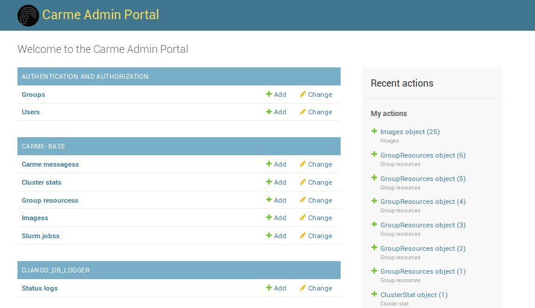

# Admin Portal

The *Carme* Admin Portal gives admins a database level access to the content and configurations of a running *Carme* system.
This includes:

* User Management
    * Display of Users, Groups and their properties
    * NOTE: currently, user settings have to be made at LDAP level - *Carme* is only reading LDAP
* Image Management
* Jobs
* Ressource Allocation 
* System log files
* Sytem notifications
