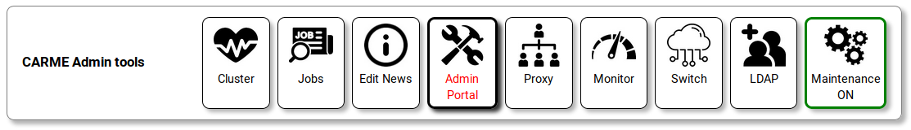
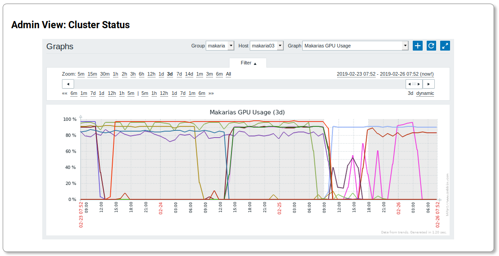
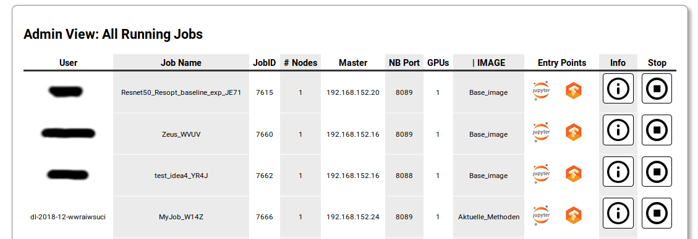

# Admin Tools in the Web-Frontend
Admins have an aditional **Admin Tools** section in the web-frontend home screen:

Availiable tools are (left to right):

* **Cluster Status** Graphs
* Table of all **running jobs**
* Edit of the **News Section** content
* [**Admin Portal**](admin-portal.md)
* **Proxy Status** (external tool provided by [Traefik](https://docs.traefik.io/) )
* **Cluster Monitor** (exteral tool provided by [Zabbix](https://www.zabbix.com/) )
* **Network Monitor** (external hook to your switch)
* **LDAP Admin** (external LDAP interface)
* **Maintenance Mode** on or off

## Cluster Staus

Shows an interactive plot of cluster activities. All plots are provided by *Zabbix* and can be configured with the Cluster Monitor tool.

## Running Jobs

## Maintenance Mode
Sets the fronted into maintenance mode:
* all users are logged out and can not log in anymore
* Maitenance Message is displayed
* **NOTE: running job are NOT affected** 
