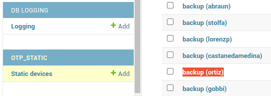

# How to reset the 2FA as admin

When a user's 2FA token doesn't work or is lost, the user cannot longer access to Carme. To solve this, the administrator has to reset the token.  The steps are given as follow:

1. Login to https://gpu-cluster.itwm.fraunhofer.de/admin/ to access the Admin Portal. Use `demo-admin`, unless your account has admin rights.
	
2. In the Admin Portal, click on the table `TOTP devices` (left column). A list of users with 2FA tokens appears on the right column. In this example we choose the user `ortiz`, see Fig. 1.

	

	
Fig. 1: TOTP devices.
 
	
3. Scroll down to the bottom of the page and click on `Delete`, see Fig. 2.

	

	
Fig. 2: Delete TOTP device.
 

4. Click on the table `Static devices` (left column). A list of users with static tokens appears on the right column. In this example we click on `backup (ortiz)`. If a user does not have static tokens, then he or she won't be listed in this table (static tokens are optional).

	

	
Fig. 3: Static devices.
 

5. Scroll down to the bottom of the page and click on `Delete`, see Fig. 4

	
	
	
Fig. 4: Delete static devices
 
	

**Note:** *The next time the user tries to log in, he/she will be requested to set up a 2FA.*

