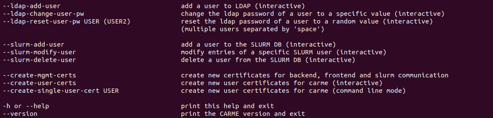
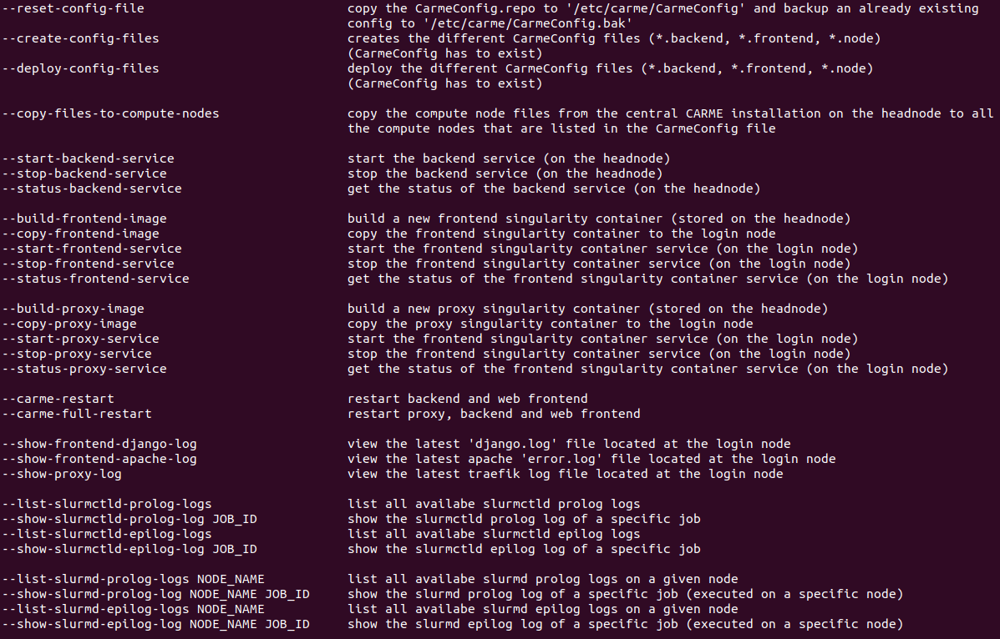

# How to use the command: carme-manager 

- In hadez or hades:
  - `carme-manager`

- The full script is given in:
  - `/opt/Carme/Carme-Scripts/carme-manager`.

- If not active. To activate `carme-manager`:
  - `cd /usr/local/bin/`
  - `ln -s /opt/Carme/Carme-Scripts/carme-manager/carme-manager.sh carme-manager`
  - `cd /usr/local/share`
  - `mkdir -p bash-completion/completions`
  - `cd bash-completion/completions/`
  - `ln -s /opt/Carme/Carme-Scripts/carme-manager/carme-manager-completion.bash carme-manager.bash`

- **arguments**:

  

  

