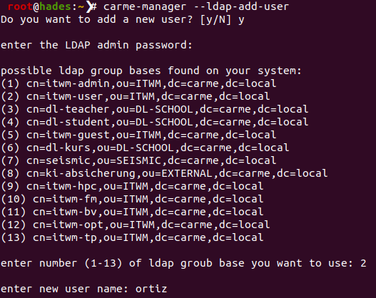
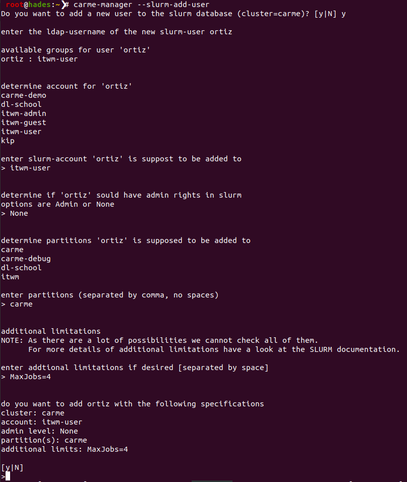

# How to create a user account (LDAP, SLURM, and SSL)

## Short version
As an example we consider user `ortiz`:

- `carme-manager --ldap-add-user`
- `carme-manager --slurm-add-user`
- `carme-manager --create-single-user-cert ortiz`

## Long version

In this example we considering that user **christian ortiz** is requesting a Carme account.

### 1) Using the bash script: carme-manager

All arguments of `carme-manager` are listed in: [How to use the command: carme-manager (arguments)](./../carme-manager/carme-manager.md).

Once the user is verified and we know what username to consider, we proceed with the following steps:

1.  Access to Styx, e.g., `ssh hades` 
2.  `carme-manager --ldap-add-user`

	
	
Fig. 6: LDAP account.
 

    In the above example we are creating an LDAP account `ortiz` in group (2): `itwm-user`.
    - *A user password is generated. You should copy this password elsewhere for later use. In case you forget to do so, the password is stored in the file `date--username.txt`. To access this file type in styx:  `cd /root/ldap-default-passwds`*

3.  `carme-manager --slurm-add-user`
	
    
	
Fig. 7: SLURM account.
 

    We have:
    - `ldap username:` ortiz
    - `slurm account:` itwm-user
    - `Admin or None:` None
    - `partition:` carme
    - `additional limitations:` MaxJobs=4

4.  for multiple users: `carme-manager --create-user-certs` 

5.  foe one user, e.g., user ortiz: `carme-manager --create-single-user-cert ortiz`

### 2) Without a bash script

The steps given in I.1) become:

1.  `ssh hades`
2.  `cd /opt/Carme`
3.  `cd Carme-Scripts/ldap`
4.  `bash carme-ldap-add-user-sh` (ldap account, refer to Fig. 6)
5.  `cd ../slurm/mgmt-scripts`
6.  `bash carme-slurm-add-user.sh` (slurm account, refer to Fig. 7)
7.  `cd /opt/Carme/Carme-Backend/SSL`
8. `bash create-and-deploy-user-certs.sh`

If we want to modify something in slurm we do:

1.  `cd /opt/Carme`
2.  `cd Carme-Scripts/slurm`
3.  `bash carme-slurm-modify-user.sh`
4.  Enter what you want to modify, e.g.,: `MaxJobs=1`
