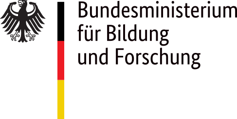

# **Carme** documentation

This is the documentation of the [Carme](www.open-carme.org) project: 

  *"An open source software stack to manage resources for **multiple-users** running **interactive jobs** on **HPC Clusters**"* 

## Sections

#### [**User** Documentation](UserDoc/readme.md)
- How to use Carme

#### [**Admin** Documentation](AdminDoc/README.md)
- How to administrate Carme

#### [**Installation** Documentation](AdminDoc/README.md) 
- How to install Carme ( release date: April 2024 )

## Who is behind Carme?

**Carme** is developed by the [Data Analysis and Machine Learning Group](https://www.itwm.fraunhofer.de/en/departments/hpc/data-analysis-and-machine-learning.html) of the [Competence Center for High Performance Computing](https://www.itwm.fraunhofer.de/en/departments/hpc.html) at [Fraunhofer ITWM](https://www.itwm.fraunhofer.de).

## Contact

 [christian.ortiz\@itwm.fraunhofer.de](mailto:christian.ortiz@itwm.fraunhofer.de) 

## Sponsors
**The development of Carme is financed by research grants from**

  

