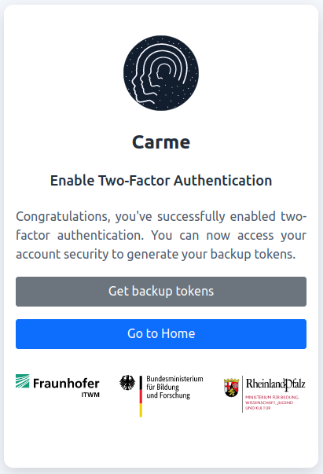
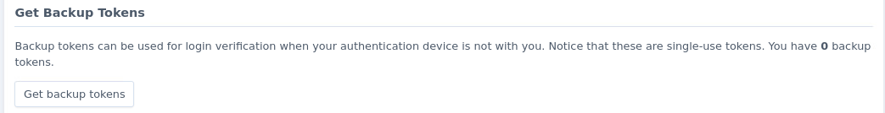
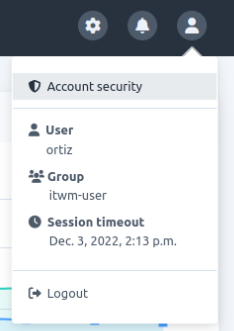
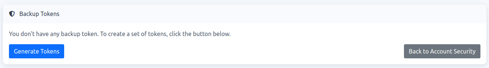
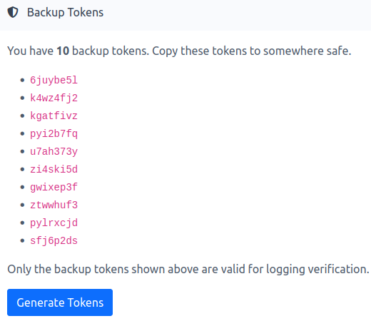
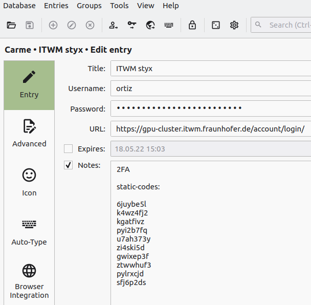
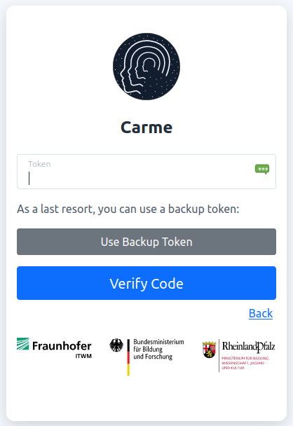
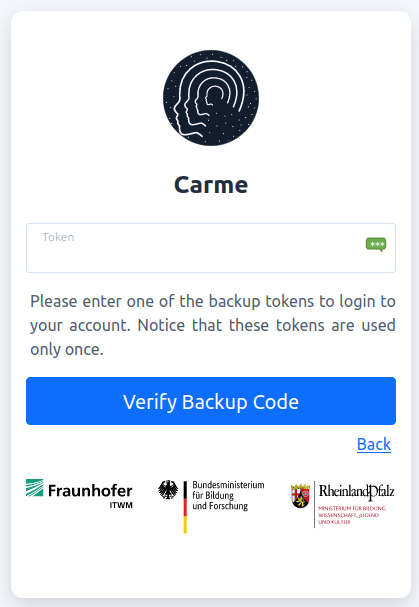

# How to get backup tokens

Backup tokens are alternative 2FA keys that allow you to access **Carme** when you don't have your primary 2FA key with you. These tokens are used only once. You can always generate a new set of tokens if you are running out of them.

1.  When you log in to Carme for the first time, you are requested to set your backup tokens. To do so, click on `Get backup tokens`, see Fig. 1.
  
    
    
    Fig. 1: Get backup tokens.
    
2.  You are then redirected to the `Account security` page, where you can click on `Get backup tokens`, see Fig. 2.
    
    
    
    Fig. 2: Account security.
    
3.  In case you did not choose `Get backup tokens` in the first step, then you can set your backup tokens later on. To do so just click on `Account security` on the top navigation bar of the Carme page and then follow the previous step, see Fig. 3
    
    
    
    Fig. 3: Access to account security.
    
4.  By clicking on `Get backup tokens` in Fig. 2, you are redirected to the  `Backup Tokens` page, there you will have 0 tokens. To generate a set click on `Generate Tokens`, see Fig. 4.
    
    
	
    Fig. 4: Generate tokens.
    
5.  As shown in Fig. 5, 10 backup tokens are generated. Copy these tokens to somewhere safe.

    
    
    Fig. 5: 10 backup tokens.
    
6.  For example, you can copy them to your Carme entry in your KeePassXC database, see Fig. 6
    
    
    
    Fig. 6: backup tokens copied to KeePassXC.
    
    To learn more about KeePassXC, refer to: [How to set up the 2FA using KeePassXC](../2FA-keepass-xc/2FA-keepass-xc.md).
    

7.  To use a backup token, in the second step of the login page, instead of writing the 2FA token in the input field, click on: `Use Backup Token`.
    
    
    
    Fig. 7: Use backup token.
    
8.  Then type one of your backup tokens and click on `Verify Backup Code`.
    
    
    
    Fig. 8: Verfiy backup code.
    
9.  Discard the backup token used and you are all set (backup tokens are used only once).
