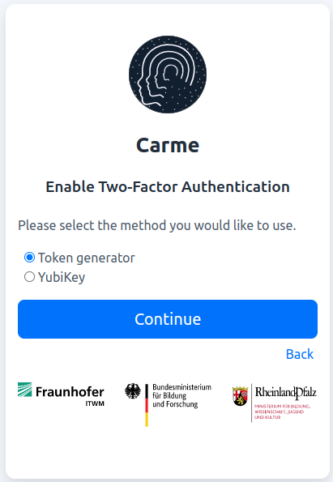
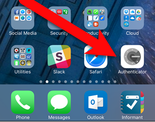
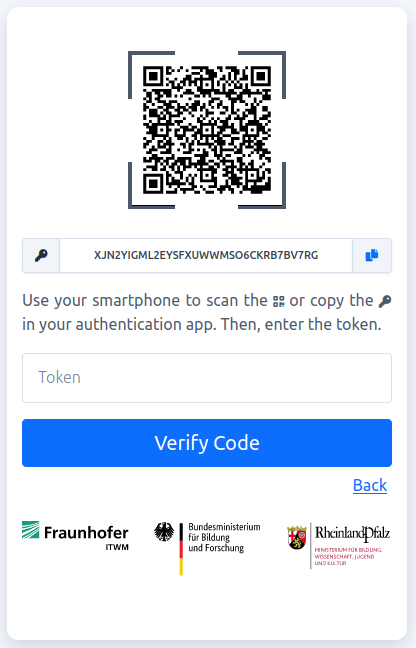
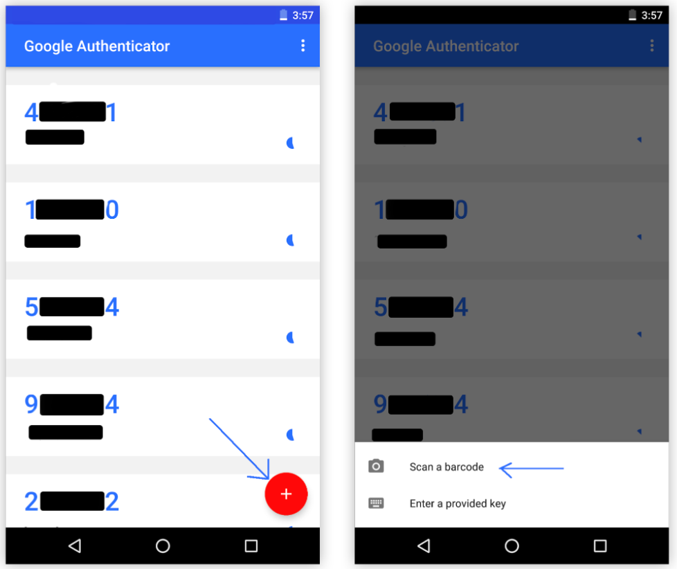
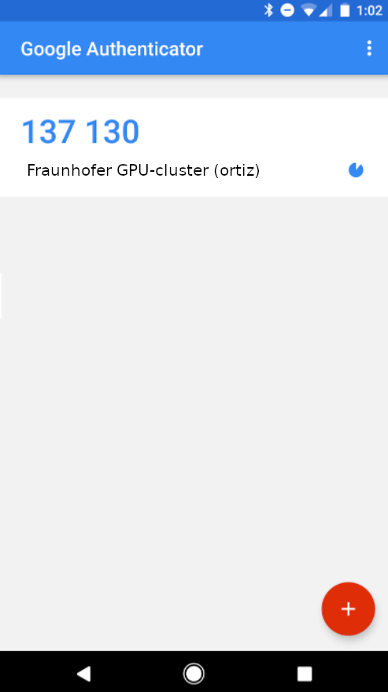
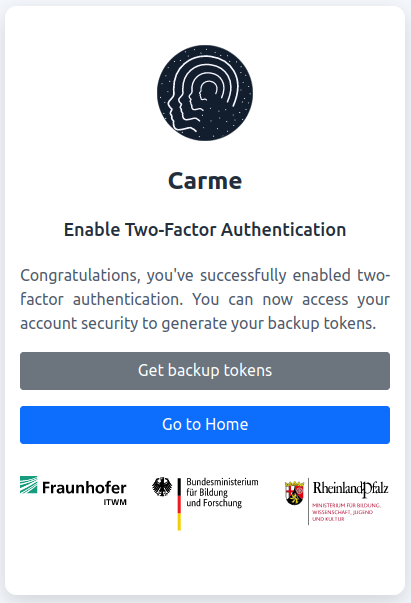

# How to set up the 2FA using Google Auth 

**Note:** You can choose a different mobile app as a token generator.

1.  `Sign-in` to Carme.

    
	
    Fig. 1: Log-in.
    
2.  Choose `Token generator` and `Continue`.

    
	
    Fig. 2: Token-generator.
    
3.  Install `Google Authenticator` in your phone.

    
	
    Fig. 3: Google Auth.
    
4.  To set your 2FA, pay attention to the `QR-code`, see Fig. 4.
    
    
    
    Fig. 4: QR-code.
    
5.  Grab your phone and open the `Google Authenticator` app. On the main screen, click on the **+** symbol $\rightarrow$ `scan a barcode`, see Fig. 5.
    
    
    
    Fig. 5: Google Authenticator.
    
6.  Your camera is activated. Now you can scan the `QR-code` given in Fig. 4. Once done, the app shows your TOTP token, see Fig. 6.
    
    
    
    Fig. 6: TOTP token.
    
    In this example the user is `ortiz` and the token is `137130`. This token is updated every 30 seconds.
    
7.  Type the token in the input field given in Fig. 4, and then click on `Verify Code`.... Congratulations! You have enabled the 2FA. Now you can create [backup tokens](../2FA-backup/2FA-backup.md) by clicking on `Get backup tokens`, See Fig. 7.
    
    
    
    Fig. 7: Get backup tokens.
    
