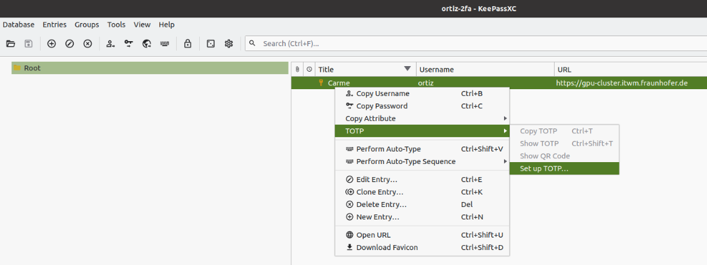
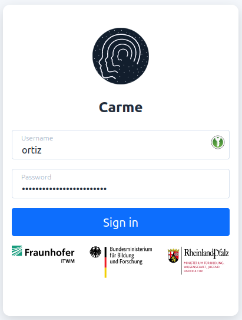

# How to set the 2FA using KeePassXC

**Note:** You can choose a different desktop app as a token generator.

1.  `Sign-in` to Carme.
    
    
    
    Fig. 1: Log-in.
    
2.  Choose `Token generator` and `Continue`.
    
    
    
    Fig. 2: Token-generator.
    
3.  In Fig. 3 pay attention to the `key-code` given. In this example it is `XJN2YIGML2EY5FXUWWMSO6CKRB7BV7RG`. You will use this code later on when you set up TOPT in KeePassXC. Don't close this page. We will come back later on.
    
    
    
    Fig. 3: Key-code.
    
4.  Install KeePassXC in your desktop. Refer to https://keepassxc.org/download/. Below we show the Linux version. If you use Windows, the UI may be different. You can also choose another Keepass tool such as https://keepass.info/. 

    Open KeePassXC and create a new Database, i.e., on the navigation bar choose `Database` $\rightarrow$ `New Database`, see Fig. 4.
    
    
    
    Fig. 4: New Database.
    
5.  Choose a cool Database Name and click on `Continue`, see Fig. 5.
    
    
    
    Fig. 5: Create database.
    
6.  Use the default set up in the `Encryption settings`. Click on `Continue`, see Fig. 6
    
    
    
    Fig. 6: Encryption settings.
    
7.  Enter and confirm a password for your database. Then click on `Done`, see Fig. 7.
    
    
    
    Fig. 7: Database password.
    
8.  Choose a name for your KeePassXC file. As shown in Fig. 8, in this example, the name of the file is the same as the name of the database. By default this file is stored in the folder `passwords` located in your home directory. You are free to change this location if needed. Once set, click on `Save`.
    
    
    
    Fig. 8: KeePassXC file.
    
9.  Congratulations! You have created your database. Now you can add an entry to this database by clicking on the **+** button located in the navigation bar, see Fig. 9.
    
    
    
    Fig. 9: Create new entry.
    
    **Note:** *You can further organize your database by creating groups (subfolders). In this example, for simplicity, we disregard this and directly add the new entry to the `Root` folder.*
    
10. In this new entry you can add your login information to Carme. An example is given in Fig. 10. Once you fill your information click `Ok`.
    
    
    
    Fig. 10: How to fill your new entry.
    
11. Once your entry is created, right click on it $\rightarrow$ TOTP $\rightarrow$ Set up TOTP, see Fig. 11.
    
    
    
    Fig. 11: Set up TOTP.
    
12. In the new window, where it says `Secret Key`, copy the `key-code` given in Fig. 3. Then click `Ok`, see Fig. 12.
    
    
    
    Fig. 12: Type the Secret Key.
    
13. Congratulations! Your 2FA is enabled in KeePassXC. To see your 2FA token, right click on your entry $\rightarrow$ TOTP $\rightarrow$ Show TOTP, see Fig. 13.
    
    
    
    Fig. 13: Show TOTP.
    
14. Your 2FA token is shown (see Fig. 14), copy it and paste it in the token field given in Fig. 3. Then verify the code and your are all set.
    
    
    
    Fig. 14: 2FA token in KeePassXC.
    

**Note:** *You can create backup tokens and store them in your KeePassXC Carme entry as shown in Fig. 10. Also, if you like, you can set up your 2FA token in both, your mobile app and your desktop app. Both will behave the same.*

## Optional: KeePassXC (browser plugin)

To be more efficient you can download the KeePassXC browser plugin. It exists in Chrome and Firefox. Here I show the steps in Firefox. Similar steps are given in Chrome.

15. Install the plugin from https://addons.mozilla.org/en-US/firefox/addon/keepassxc-browser/ by clicking on `Add to Firefox`, see Fig. 15.
    
    
    
    Fig 15: KeePassXC Firefox plugin.
    
16. A window pops-up. Click on `Add`, see Fig. 16.
    
    
    
    Fig. 16: Add KeePassXC plugin.
    
17. A second window pops-up. Click on `Okay`, see Fig. 17.
    
    
    
    Fig. 17: KeePassXC-Browser was added.
    
18. On the top-right corner of your browser, click on the key icon and then `connect`, see Fig. 18.
    
    
    
    Fig. 18: Connect to KeePassXC-Browser.
    
19. Since your KeePassXC desktop is active, the plugin automatically recognizes your database. In this example the database name is `ortiz-2fa`. As shown in Fig. 19, the plugin asks for a unique name to the connection. In this example, for simplicity, we choose the same name as the database and then we click on `Save and allow access`.
    
    
    
    Fig. 19: Name of the connection.
    
    **Note:** *Keep in mind that in order for the plugin to work you have to be connected to the KeeePassXC database in your KeePassXC desktop app.*
    
20. Once you set the name of the connection, a new window pops-up asking you if you want the plugin to recognize your entry `Carme`. Notice that Carme is the title of the entry you just created in step 10 and it is recognized because you also specified the URL ( if you don't specify the URL, it won't be recognized automatically). If the information is correct click on `Allowed selected`, see Fig. 20.
    
    
    
    Fig. 20: Allow the entry.
    
21. Now your Carme login page shows the KeePassXC icon (in green). Click on it and your username and password will automatically be filled. Then click on `Sign in`.
    
    
    
    Fig. 21: First step login: username and password.
    
22. The same happens with your 2FA login page. Click on the green rectangle and your 2FA token will be filled automatically . Then click on `Verify Code` and your are all set.
    
    
    
    Fig. 22: Second step login: 2FA token.
