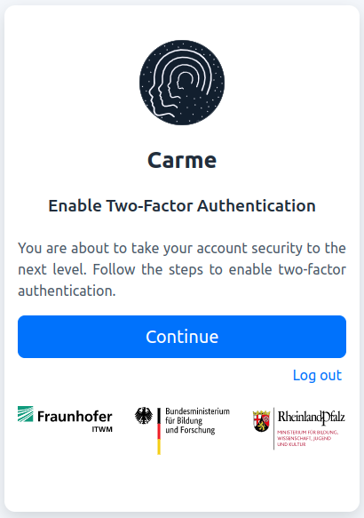

# How to reset the 2FA

1.  Go to your `account security` located on your navigation bar, see Fig. 1.
  
    
	
	Fig. 1: Account security

2.  On the next page, click on `Disable two-factor authentication`.

    
    
	Fig. 2. Disable 2FA.

3.  To confirm, check `Yes, I am sure` and click on `Disable`

    
	
	Fig. 3: Confirm Disable 2FA.
    
4.  You are redirected to enable 2FA again. Click on `Continue`, see Fig. 4.
    
    
	
	  Fig. 4: Enable 2FA.

5. Choose your 2FA authentication method:

    - [Yubikey (hardware authentication device)](../2FA-yubikey/2FA-yubikey.md)
    - [Google Auth (mobile app)](../2FA-google-auth/2FA-google-auth.md)
    - [KeePassXC (desktop app)](../2FA-keepass-xc/2FA-keepass-xc.md)
