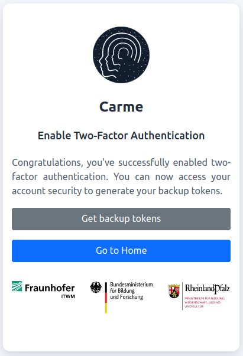

# How to set the 2FA using Yubikey

**Note:** If you already have a 2FA authenticator and want to use `Yubikey` instead, refer to: [How to reset the 2FA](../2FA-reset-user/2FA-reset-user.md).

1.  `Sign-in` to Carme.

    
    
    Fig. 1: Log-in.
    
2.  Choose `Yubikey` and `Continue`.

    
	
    Fig. 2: Enable Yubikey.
    
3.  Click on the Yubikey field.

    
	
    Fig. 3: Yubikey field.
    
4.  Insert your Yubikey in your USB port and press the **Y**-symbol, yellow circle in Fig. 4.

    
	
    Fig. 4: Yubikey device.
    
5.  A code is automatically printed on the Yubikey field. Then press `Verify Code` if needed.

    
	
    Fig. 5: Verify code.
    
6.  Congratulations you have set up a Yubikey authentication. Now you can go to your home page or get [backup tokens](../2FA-backup/2FA-backup.md).

    
	
	Fig. 6: Setup completed.
