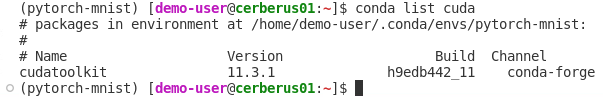
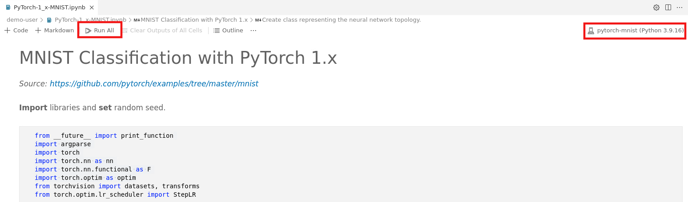

# Customize the conda environment and run your code

## Customize the conda environment

To perform meaningful calculations, we have to install additional packages in our environment. Here, we restrict ourselves to a simple example. The code we are going to work with is `/home/ENV-FILES/user-docu-examples/PyTorch-1_x-MNIST.ipynb`. To use this code, copy it to your home directory, e.g., 

- [Open a terminal](./Basic/code-server-shell/code-server-shell.md) and type:
  ```
  cp /home/ENV-FILES/user-docu-examples/PyTorch-1_x-MNIST.ipynb /home/<username>
  ```
- If your are interested in other examples, refer to the `Advanced options` section. 
- Once the file is in your `home/<username>` directory, you can [open it from this location](./Basic/code-server-jupyter-open/code-server-jupyter-open.md) and modify it at will.
- First, [ check your GPU driver version](./Basic/cuda-driver/cuda-driver.md) to know your `CUDA` limitations.
- In this example, we require the `Torch` library and the `Tochvision` package. Compatible versions are listed in https://download.pytorch.org/whl/torch_stable.html. 
- We install `PyTorch 1.10.1` and `Torchvision 0.11.2`. To do so, in the terminal [activate the conda environment](./Basic/conda-env-create-activate/conda-env-create-activate.md) that you want to work with. Then type:
  ```
  conda install pytorch==1.10.1 torchvision==0.11.2 -c pytorch -y
  ```
- Once the installation is completed you can list all your packages considering
  ```
  conda list 
  ```

- Also, you can list specific packages, e.g.,
  ```
  conda list cuda
  ```
- As you can see in Fig. 1, when you installed `PyTorch 1.10.1`, `cudatoolkit 11.3.1` was also installed.

  

  Fig .1.

## Run your code

- [Open the Jupyter notebook file](./Basic/code-server-jupyter-open/code-server-jupyter-open.md) that you copied to your `/home/<username>` directory, e.g., `PyTorch-1_x-MNIST.ipynb`. Then, [ choose the proper Jupyter kernel](./Basic/code-server-jupyter-kernel/code-server-jupyter-kernel.md)  (`pytorch-mnist` in this example) and click on `Run All`. Refer to the red rectangles in Fig. 2.

  

  Fig. 2.

- While running, you can [monitor the GPU utilization](./Basic/nvtop/nvtop.md) if needed.
- ...Congratulations! You completed the First-Time-Usage section.
