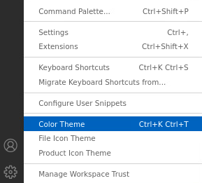
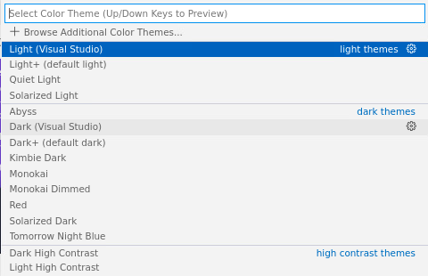
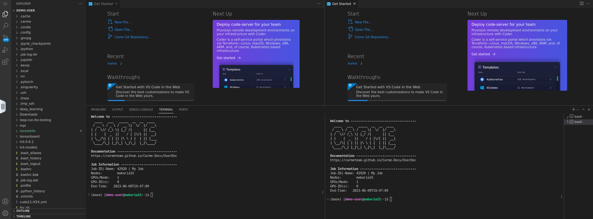

# How to change the theme color

1.  Once you [open the terminal](../code-server-terminal/code-server-terminal.md) and [split your panels](../code-server-split/code-server-split.md), the screen looks as follows.

    
   
    Fig. 1.

2. To change the theme color, click on the `gear icon`, located on the bottom-left corner of your screen. Then click on `Color Theme`. See Fig. 2.

    

    Fig. 2.
  
3. The `Select Color Theme` box opens. There, choose the theme that you prefer. For example, `Dark (Visual Studio)`. See Fig. 3.

    

    Fig. 3.

4.  Your screen looks as follows.

    

    Fig. 4.
