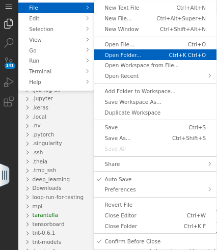
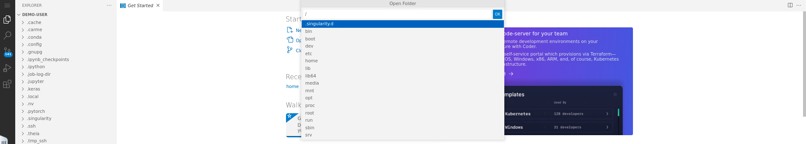
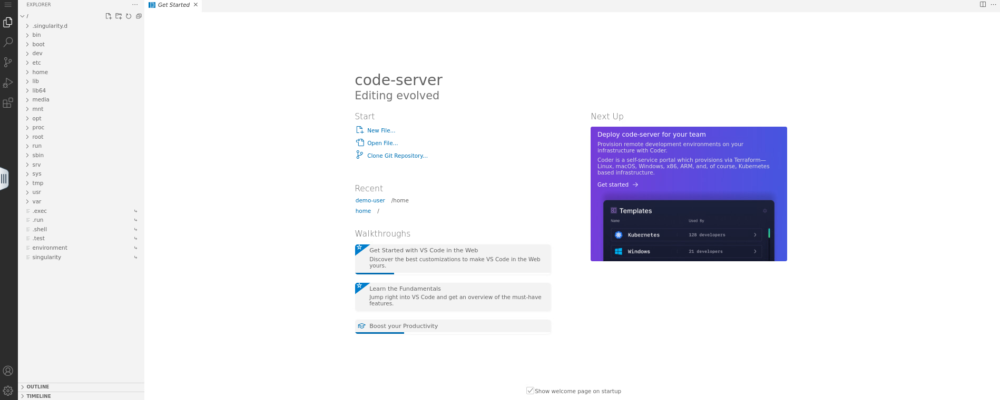

# How to navigate to a different directory

1.  To open the directory search box, click on the `menu icon`, then go to `File` -> `Open Folder`. Refer to Fig. 1.
    
    
    
    Fig. 1.
    
2. In the directory search box, type `/` and click `Ok` to access the root directory. This is the parent path of all the files in your partition. 
    
    
    
    Fig. 2.
    
3. The sidebar now shows your root directory. Refer to Fig. 3.
    
    
    
    Fig. 3.
    
4. Instead of `/` you can choose a different directory, for example `/home/<username>`.
