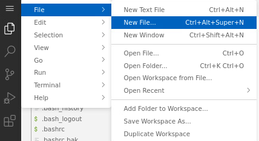
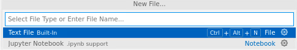
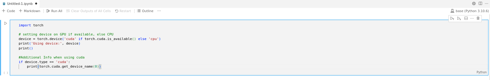
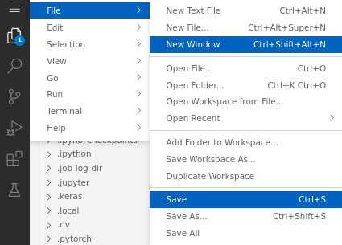
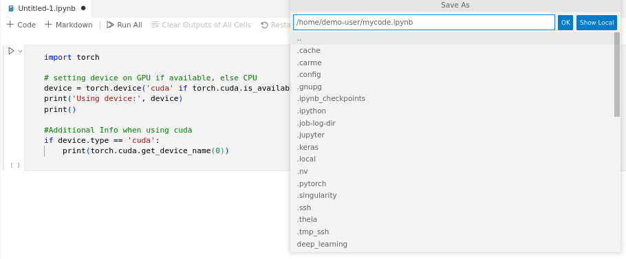

# How to create a file

Here, we create a Jupyter notebook file.

**Note**: You cannot create files in the parent `home` directory.

## Using the terminal
1. [Open the terminal](../code-server-terminal/code-server-terminal.md) and go to the directory where you want to create the file, e.g., 
  ```
  cd /home/<username>
  ```

2. Create the file. 
  ```
  touch filename.ipynb
  ```

## Using the UI
1. Click on the  `menu icon`, then go to `File` -> `New File`. Refer to Fig. 1.

    

    Fig. 1.
  
2. The `New File` box opens. Click where it says `Jupyter Notebook .ipynb support`. Refer to Fig. 2.
  
    

    Fig. 2.

3. The file `Untitled-1.ipynb` is created. Now you can write your code. Refer to Fig. 3.

    

    Fig. 3.

4. To save the file, click on the `menu icon`, then go to `File` -> `Save`. Refer to Fig. 4.

    
  
    Fig. 4.

5. The `Save As` box opens. Type the name of your file (including the path) and click `Ok`. Refer to Fig. 5, where the file is `mycode.ipynb` and the path is the `/home/<username>/` directory.

    

    Fig. 5.
