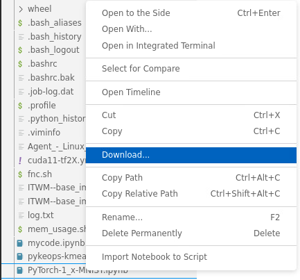

# How to upload and download files

To transfer files, you could consider your github/gitlab repository and employ git commands. If you prefer the IDE instead, then:

### To upload files

1. You can upload files considering JupyterLab, refer to: [How to upload files in Jupyterlab](../jupyterlab-file-transfer/jupyterlab-file-transfer.md).

### To download files

1. In the sidebar menu, right-click on the file that you want to download, then click on `Download`. Refer to Fig. 1.

    
