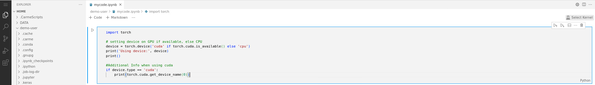
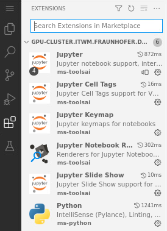

# How to install Jupyter extensions

In contrast to `Jupyterlab`, `Code-Server` requires some extensions to run Jupyter notebooks. To install them, consider the following steps:

1. [Create a Jupyter notebook file](../code-server-file-create/code-server-file-create.md) (`*.ipynb`) or [open the file](../code-server-file-open/code-server-file-open.md) if it already exists, then click on `Select Kernel`. Refer to Fig. 1, top-right. 
 
    

    Fig. 1.
  
2. The `Select Kernel` box appears. Click on `Install suggested extensions Python + Jupyter` to automatically install all the extensions needed, see Fig. 2. Note that this suggestion is present only if your Jupyter notebook file is saved; therefore, when you create a file, save it before proceeding with this step. 

    
  
    Fig. 2.

3. On the sidebar, click on the `extensions icon` to list your installed extensions. Refer to Fig. 3.

    
  
    Fig. 3.

4. Similarly, you could proceed with the installation manually. Click on the `extensions icon`  to search for extensions in the marketplace. Refer to the search box in Fig. 3. To properly run Jupyter notebooks, install all the extensions given in Fig. 3.
