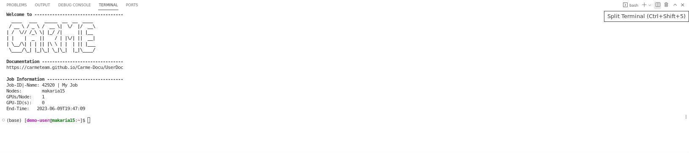

# How to split the screen

1. Once you [open the terminal](../code-server-terminal/code-server-terminal.md), your screen is splitted in two: i) the top panel, where you can open your files, and ii) the bottom panel, where you can access the shell. Refer to Fig. 1.

    

    Fig. 1.

2.  You can further split the panels. To split the bottom panel in two (terminals), click on the `Split Terminal icon`. Refer to Fig. 2, top-right corner.
  
    

    Fig. 2.
   
3. To split the top panel in two, click on the `Split Editor icon`. Refer to Fig. 3, top-right corner.

    
  
    Fig. 3.

4.  Your screen looks as follows.

    
    
    Fig. 4.

