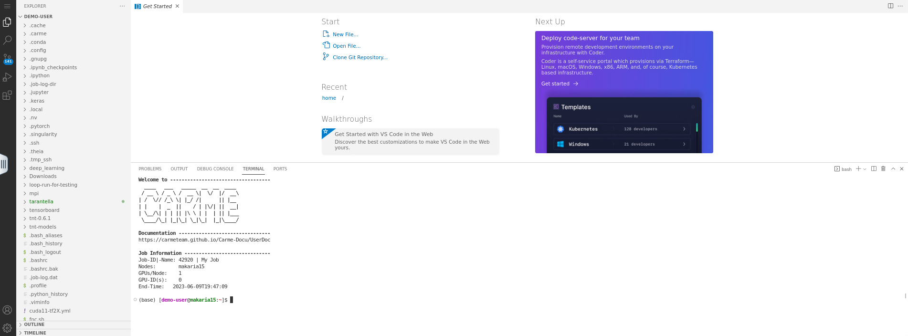

# How to open a terminal
  
1.  To open a terminal, click on the `menu icon`, then go to `Terminal` -> `New Terminal`.
  
    
   
    Fig. 1.
   
2. Your screen is splitted in two parts: i) the top panel, where you can open your files, and ii) the bottom panel, where you can access the shell. Refer to Fig. 2.

    

    Fig. 2.

