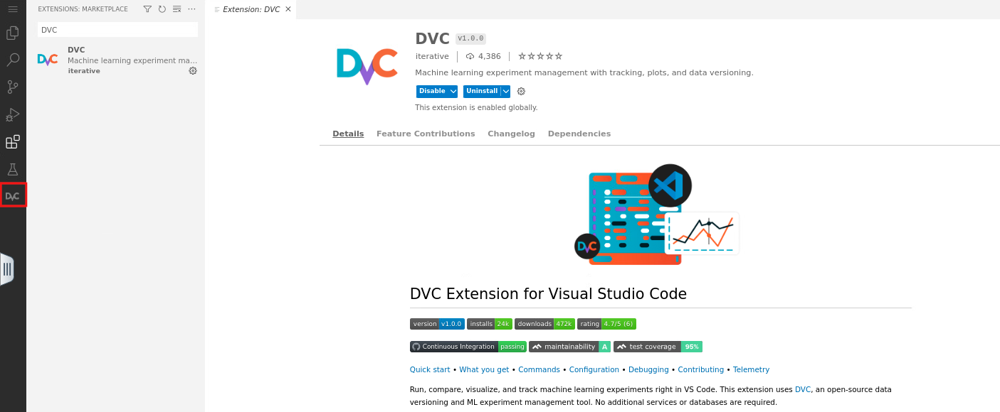

# How to install Visual Studio Code extensions

Visual Studio (VS) Code extensions are tools that you can install in `Code-Server` to make your workflow better. To learn more about these extensions refer to https://code.visualstudio.com/docs/editor/extension-marketplace. To install an extension consider the following steps:

1. Click on the `extensions icon`. Then, type the extension that you want to install in the search box. Refer to Fig. 1

    !code-server-vsc-extension-1.png](images/code-server-vsc-extension-1.png)

    Fig. 1. 

2. Once you type the name, click on `Install`. In this example, we install the MLOps tool `DVC`. Refer to Fig. 2.

    

    Fig. 2.

3. Once the installation is completed, you can see the `DVC icon` on the sidebar, see red square in Fig. 3. Click on it to start using `DVC`. 

    

    Fig. 3.
  
4. On the sidebar, click on the `extensions icon` to list your installed extensions. In Fig. 1, for example, you can see that we already installed Jupyter extensions. If you want to install them, refer to: [How to install Jupyter extensions](../code-server-jupyter-extension/code-server-jupyter-extension.md).
