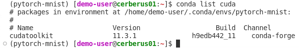

# How to customize a conda environment


To perform meaningful calculations, we have to install additional packages in our conda environment. If you don't have a conda environment installed, refer to: [How to create and activate a conda environment](../conda-env-create-activate/conda-env-create-activate.md). Here, we restrict ourselves to a simple example. The code we are going to work with is `/home/ENV-FILES/user-docu-examples/PyTorch-1_x-MNIST.ipynb`. To use this code, copy it to your home directory, e.g., 

1. [Open a terminal](../code-server-terminal/code-server-terminal.md) and type:
    ```
    cp /home/ENV-FILES/user-docu-examples/PyTorch-1_x-MNIST.ipynb /home/<username>
    ```
    If your are interested in other examples, refer to the `Advanced options` section. 

2. Once the file is in your `home/<username>` directory, you can [open it from this location](../code-server-file-open/code-server-file-open.md) and modify it at will.
3. First, [ check your GPU driver version](../cuda-driver/cuda-driver.md) to know your `CUDA` limitations.
4. In this example, the `Torch` library and the `Tochvision` package are required. Compatible versions are listed in https://download.pytorch.org/whl/torch_stable.html. 
5. Install `PyTorch 1.10.1` and `Torchvision 0.11.2`. To do so, [activate the conda environment](../conda-env-create-activate/conda-env-create-activate.md) that you want to work with and then install the packages in it:
    ```
    conda activate <name>
    conda install pytorch==1.10.1 torchvision==0.11.2 -c pytorch -y
    ```
6. Once the installation is completed you can list all your packages considering
    ```
    conda list 
    ```

7. Also, you can list specific packages, e.g.,
    ```
    conda list cuda
    ```
8. As you can see in Fig. 1, when you installed `PyTorch 1.10.1`, `cudatoolkit 11.3.1` was also installed.

    

    Fig .1.

9. Your environment now has the necessary packages to run `PyTorch-1_x-MNIST.ipynb`. To run it, refer to: [How to run a Jupyter notebook file](../code-server-run/code-server-run.md).
