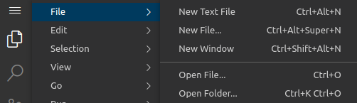
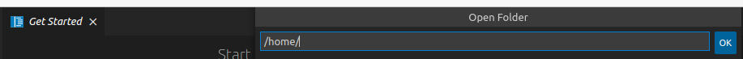
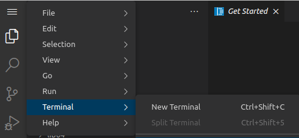
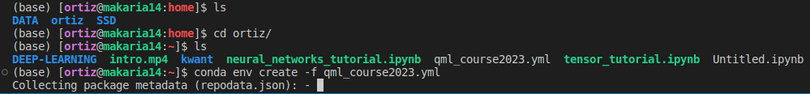
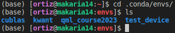

# Create a conda environment from a `*.yml` file

## Short version: 

In the terminal type `conda env create -f NAME_OF_FILE.yml` and you are all set.

## Long version:

In `code-server` we are going to consider a `*.yml` file located in your `home/USERNAME` directory.

1.  Go to `File` -> `Open Folder`, see Fig. 1.

     
     
	 Fig. 1.

2. Type `/home/` and click `OK`, see Fig. 2.
    
	
    
	Fig. 2.

3.  Go to `Terminal` --> `New Terminal`, see Fig. 3.

     
    
	 Fig. 3.

4. In the terminal you are in your home directory.
    - `cd USERNAME/`
    - `ls` (verify that the `*.yml` file is there. In this example is `qml_course2023.yml`)
    - `conda env create -f qml_course2023.yml` or
      
      `conda env create -n NewName -f qml_course2023.yml` if you prefer a different name, refer to Fig. 4.

      
      
	  Fig. 4.

5. The environment creation usually takes time. Be patient.

   **Optional**: Once completed type 
    - `cd .conda/envs` -> `ls`
 
       
	   
	   Fig. 5.

       In Fig. 5 you can check that you now have an environment named `qml_course2023`.

6. To activate it, type `conda activate qml_course2023`. To deactivate it type  `conda deactivate`. If in step 4 you chose `NewName` then use this name instead.

