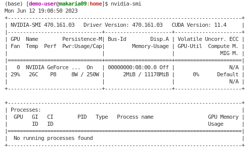

# Check the GPU driver version
Before setting up your conda environment, it is important to know the  `GPU driver version`. 
- Open the terminal and type `nvidia-smi`

  

  Fig. 1.

In this example, the driver version is `470.161.03`. To understand the limitations of the driver version, refer to: 
 - https://docs.nvidia.com/deploy/cuda-compatibility/ 
 - https://docs.nvidia.com/cuda/cuda-toolkit-release-notes/index.html 

In this example, the following table summarizes the limitations.

Table 1. CUDA Toolkit Minimum Required Driver Versions.
| CUDA Toolkit | Linuxx86_64 Minimum Required Driver Version |
|--|--|
| CUDA 12.x | >=525.60.13  |
| CUDA 11.x | >=450.80.02 |

Table 1 tells us that our GPU works ok with CUDA Toolkit 11.0 - 11.8.x.
