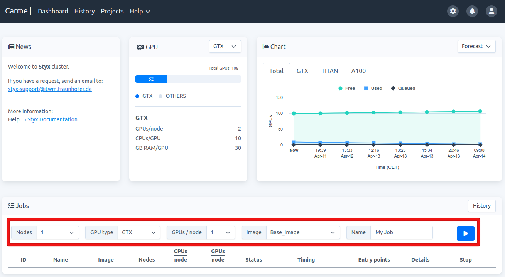
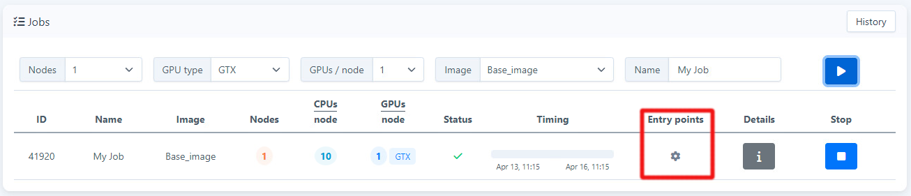
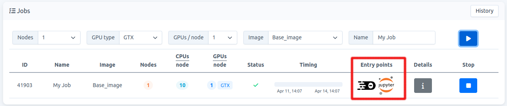

# How to start a job

1.  Go to your Dashboard. In your `Jobs-card`, choose the resources needed, then click on `Play` (blue button). Refer to the red rectangle in Fig. 1.
    
     
    
    Fig. 1.
    
2.  Your job is listed in your `Jobs-card`. While loading, your entry-points show a gear icon. This process takes a few seconds. Refer to the red rectangle in Fig. 2.
    
     
    
    Fig. 2.
    
3.  Once your job is allocated, your entry-points become visible. Refer to the red rectangle in Fig. 3.
    
    
    
    Fig. 3.
    
4.  Choose either, `Code-Server` (left icon) or `JupyterLab` (right icon). 
    

