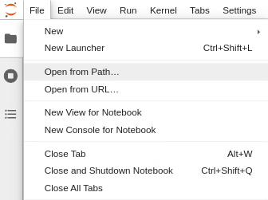
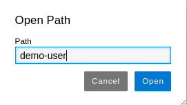
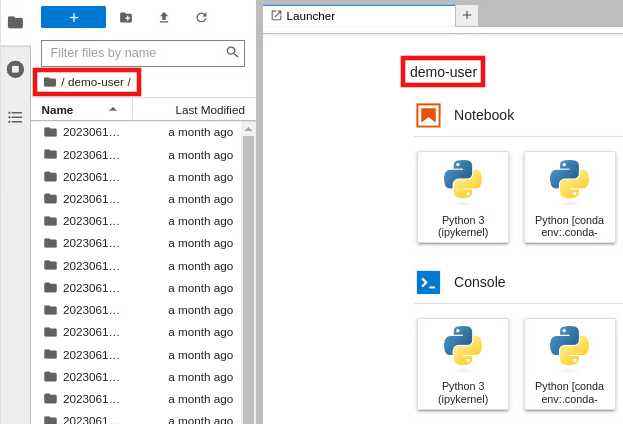

# How to navigate to a different directory

1.  Go to `File` -> `Open from Path`. Refer to Fig. 1.
    
    
    
    Fig. 1.
    
2. The `Open Path` box opens. Type the path and click on `Open`. Notice that here, the parent path is the `home` directory, then to access, e.g.,  the `/home/<username>` directory, it is enough type `<username>`. Refer to Fig. 2.
    
    
    
    Fig. 2.
    
3. The sidebar and the Launcher now shows the `/home/<username>` directory. Refer to Fig. 3, red rectangles.
    
    
    
    Fig. 3.
    

