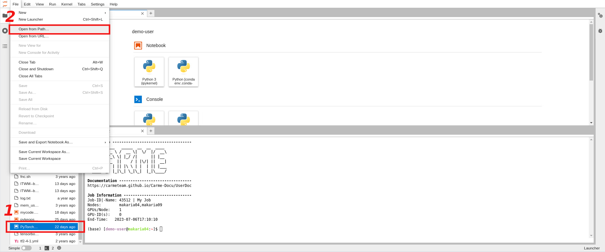
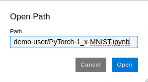
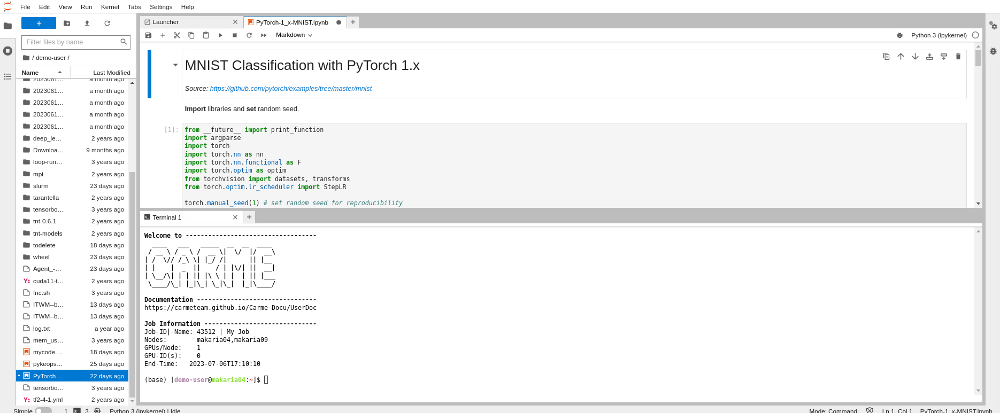

# How to open a file

Here, we show how to open the file `PyTorch-1_x-MNIST.ipynb` located in the `/home/<username>/` directory. 

1. There are two possible ways to open a file. Refer to the red rectangles in Fig. 1 for each of them.
    -  METHOD 1: Directly search for the file in the sidebar menu.
    -  METHOD 2: Go to `File` -> `Open from Path`.
  
    
  
    Fig. 1.
 
2. When you consider METHOD 2, the `Open Path` box opens. There, type the name of the file with the correct path and click on `Open`. Note that it is enough to type `<username>/Pytorch-1_x-MNIST.ipynb` to open the file located in the `/home/<username>/` directory. Refer to Fig. 2. 

    
  
    Fig. 2.
  
3. In Fig. 3, we show how your screen looks like once you open the file `PyTorch-1_x-MNIST.ipynb`.

    

    Fig. 3.

