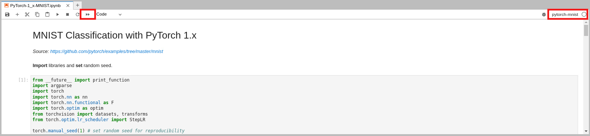

# How to run a Jupyter notebook file

Once your [conda environment is customized](../conda-env-customize/conda-env-customize.md), you can run your code considering the following steps:

1. [Open the Jupyter notebook file](../jupyterlab-file-open/jupyterlab-file-open.md) that you copied to your `/home/<username>` directory, e.g., `PyTorch-1_x-MNIST.ipynb`. 
2. [Choose the proper Jupyter kernel](../jupyterlab-kernel/jupyterlab-kernel.md)  (`pytorch-mnist` in this example), and click on `Restart kernel and run all cells`. Refer to the red rectangles in Fig. 2.

    

    Fig. 2.

3. While running, you can [monitor the GPU utilization](../nvtop/nvtop.md) if needed.

