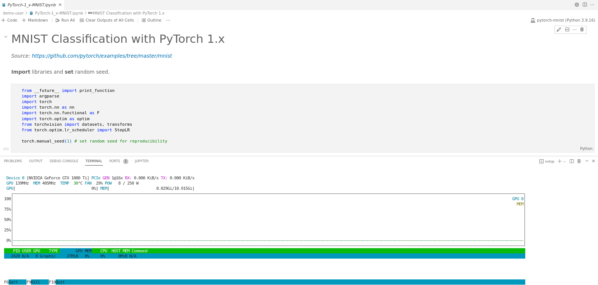
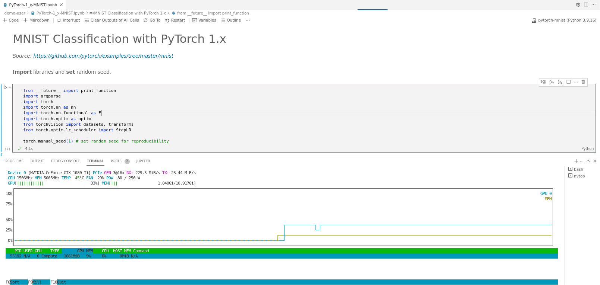

# How to monitor the GPU utilization

- [Open a Jupyter notebook file](../code-server-file-open/code-server-file-open.md) and [choose the proper kernel](../code-server-jupyter-kernel/code-server-jupyter-kernel.md).
    
- [Open the terminal](../code-server-terminal/code-server-terminal.md) and type:
    
    ```
    nvtop
    ```
    
- Your screen should look like Fig. 1.
    
    
    
    Fig. 1.
    
- If you want to test the same example as given in Fig. 1, refer to the `First-Time-Usage` section for further details.
    
- [Run your code](../code-server-run/code-server-run.md)... While running, `nvtop` looks like Fig. 2.
    
    

    Fig. 2. 
    
- To close `nvtop`, press `F10`.
    
- As shown in Fig. 2, `nvtop` allows you to monitor in real time how much GPU processing power, `GPU (%)`, and memory, `MEM (GB)`, your code is using. In this example we are condering the GPU `GeForce GTX 1080 Ti`. To check all available GPUs in Styx and its specs refer to [available GPUs and node types](../../System/cluster/cluster.md).
## GPU (%)
- While running this example, the GPU utilization is 33%, see Fig. 2. That is, we are not using the full potential of the GPU. We can increase this percentage by optimizing the code. 

## MEM (GB)
- While running this example, the memory utilization is ~9.5%, or ~1GB/11GB, see Fig. 2. In principle, training large models require more memory. If you exceed the memory, your code will stop. You can also [check the log file of your job](../log-file/log-file.md) to understand why your code have stopped.
