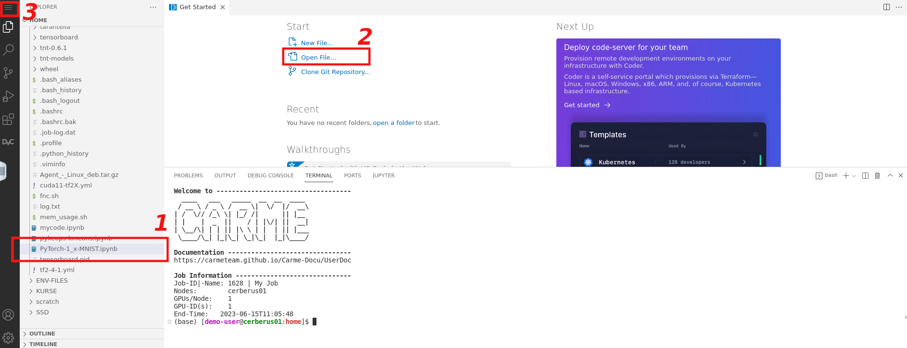
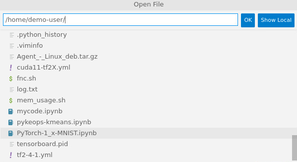
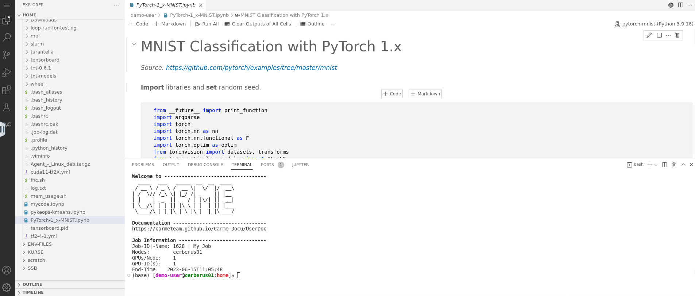

# How to open a file

Here, we show how to open the file `PyTorch-1_x-MNIST.ipynb` located in the `/home/<username>/` directory. 

1. There are three possible ways to open a file. Refer to the red rectangles in Fig. 1.
    -  METHOD 1: Directly search for the file in the sidebar menu.
    -  METHOD 2: Click on `Open File` in the main screen.
    -  METHOD 3: Click on the `menu icon`, then go to `File` -\> `Open File`.
  
    
  
    Fig. 1.
 
2. When you consider METHOD 2 or METHOD 3, the `Open File` box opens. In the input field, type the right path, e.g., `/home/<username>`, then look for the file scrolling down the list. Refer to Fig. 2.

    
  
    Fig. 2.
  
3. Click on the file to open it. In Fig. 3, we show how the screen looks like once you open the file `PyTorch-1_x-MNIST.ipynb`.

    

    Fig. 3.

