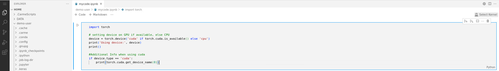

# How to install Jupyter extensions

In contrast to `Jupyterlab`, `Code-Server` requires some extensions to run Jupyter notebooks. To install them, consider the following steps:

1. [Create a Jupyter notebook file](../code-server-file-create/code-server-file-create.md) (`*.ipynb`) or [open the file](../code-server-file-open/code-server-file-open.md) if it already exists, then click on `Select Kernel`. Refer to Fig. 1, top-right. 
 
    

    Fig. 1.
  
2. The `Select Kernel` box appears, see Fig. 2. Choose:

   - `Install suggested extensions Python + Jupyter` 

   or

   - `Browse marketplace for kernel extensions`

   The first option automatically installs all the extensions needed. The second option opens a sidebar with recommended plugins to install.

    
  
    Fig. 2.

3. If you don't see the sidebar with the installed / recommended extensions, click on the `extensions icon`, see Fig. 3:

   

   Fig. 3.
  
   We recommend installing the following extensions:

   - Jupyter
   - Python

    **Note:** Jupyter extension already includes all the the other Jupyter plugins given in Fig. 3. Therefore you just need to install Jupyter and Python extensions.

