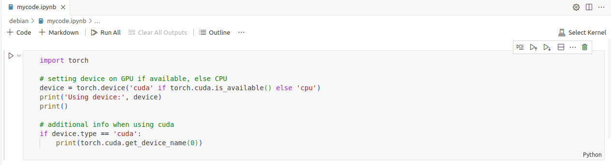
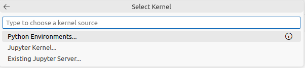
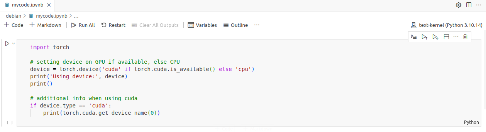

# How to install and choose a Jupyter kernel

## Install the kernel

To run Jupyter notebooks, you need to add a Jupyter kernel in every conda environment that you create. 

1. [ Activate your conda environment ](../conda-env-create-activate/conda-env-create-activate.md) (if it is not).

2. Then, type the following, choosing your own `<name>` (this name can be different from your conda env name): 

    ```
    conda install ipykernel -y && ipython kernel install --user --name "<name>"
    ```
3. You can list your installed Jupyter kernels considering:

    ```
    ls /home/<username>/.local/share/jupyter/kernels
    ```

    or

     ```
    jupyter kernelspec list
    ```
    
4. Refresh your page to update the changes on the screen. 

## Choose the kernel

1. [Open a Jupyter notebook file](../code-server-file-open/code-server-file-open.md) and click on the `kernel button`. Refer to Fig. 1, top-right (in this example, the kernel button reads `Select Kernel` but it can also say `base (Python 3.10.x)`.
 
    
  
    Fig. 1.

2. The kernel box opens. Choose `Jupyter Kernel`, refer to Fig. 2.

    
  
    Fig. 2.
  
3.  As shown in Fig. 3, your Jupyter Kernels are listed, choose the one that you will use with your conda environment. In this example is called `text-kernel`.

    
  
    Fig. 3.

3. As shown in Fig. 4, top-right, the kernel button now shows the selected kernel. With this, you are ready to work with it.

    
  
    Fig. 4.

