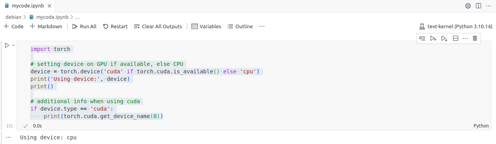

# How to run a Jupyter notebook file

Once your [conda environment is customized](../conda-env-customize/conda-env-customize.md), you can run your code considering the following steps:

1. [Open the Jupyter notebook file](../code-server-file-open/code-server-file-open.md), e.g., `mycode.ipynb`. 
2. [Choose the proper Jupyter kernel](../code-server-jupyter-kernel/code-server-jupyter-kernel.md)  (`text-kernel` in this example), and click on `Run All` (top panel in Fig. 2).

    

    Fig. 2.
