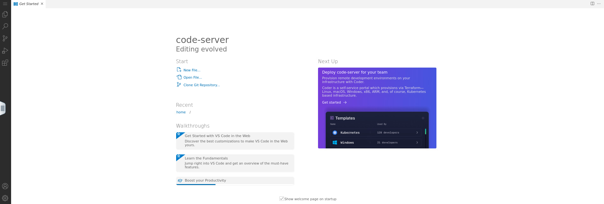
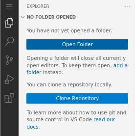
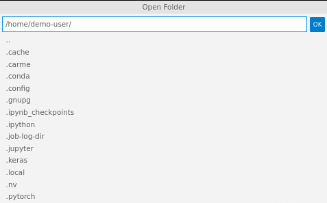
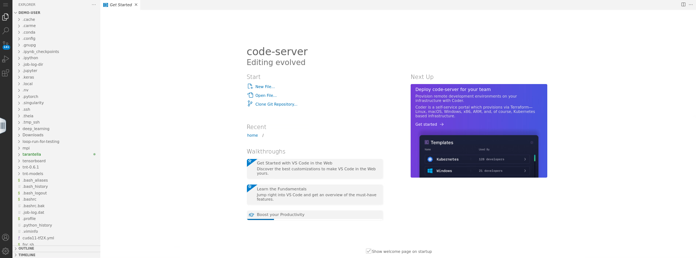
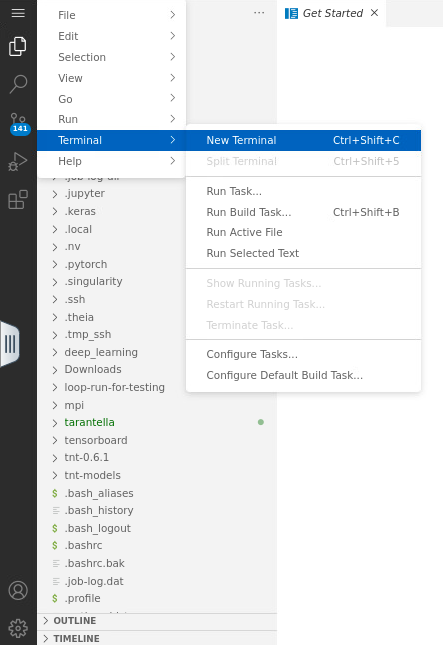
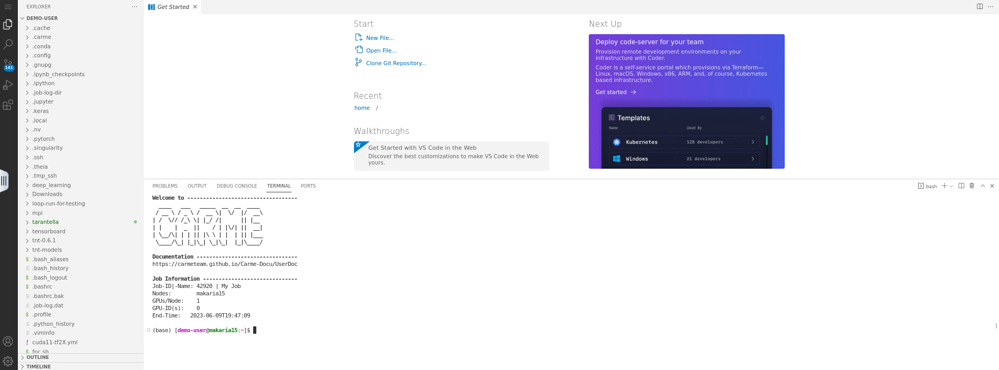

# How to set up Code-Server

1. When you access `Code-Server`, the screen looks like Fig. 1.

    

    Fig. 1.
  
2. Click on the `explorer icon` and then click on `Open Folder`. Refer to Fig. 2.

    

    Fig. 2.
  
3. The `Open Folder` box opens. Type `/home/<username>/` in the input field and click `OK`. Refer to Fig. 3.

    

    Fig. 3.
  
4. The page refreshes. Now you can see on the left-hand side of your screen, your `<username>` directory. Refer to Fig. 4. 
   
   - If you would like to set a different directory, refer to:  [How to navigate to a different directory](../code-server-directory/code-server-directory.md).

    
  
    Fig. 4.
  
5.  To open the terminal, click on the `menu icon`, then go to `Terminal` -> `New Terminal`. Refer to Fig. 5.
  
    
   
    Fig. 5.
   
6. Your screen is splitted in two parts: i) the top panel, where you can open your files, and ii) the bottom panel, where you can access the shell. Refer to Fig. 6.

    

    Fig. 6.
