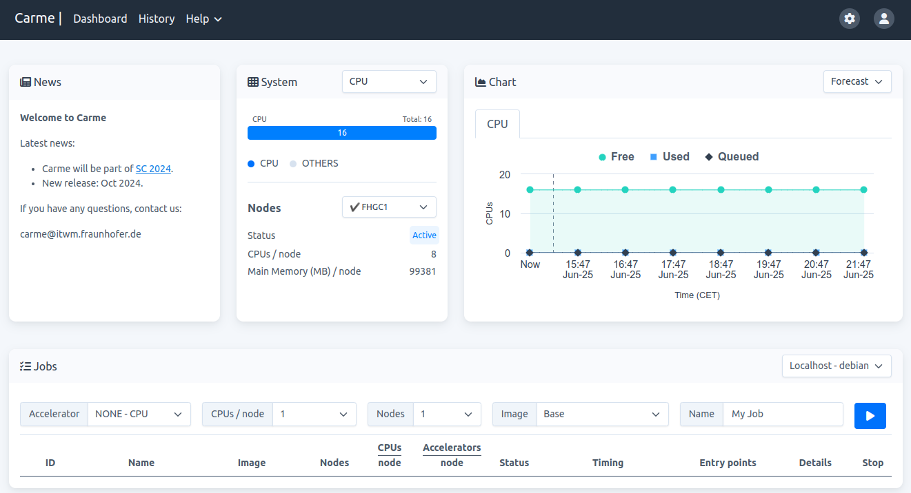
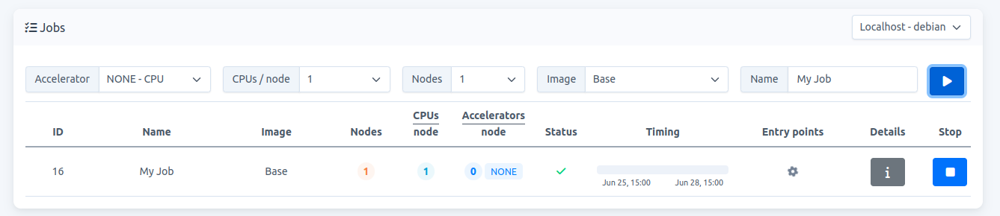
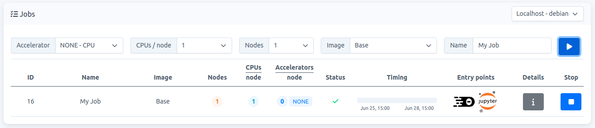

# How to start a job

1.  Go to your Dashboard page. In your `Jobs-card` (bottom card in Fig. 1), choose the resources needed, then click on `Play` (blue button).
    
     
    
    Fig. 1.

    **Note:** Carme-demo uses CPUS; therefore, no accelerators (NONE in `Jobs-card`).

2.  Once your resources are allocated, your job is listed in your `Jobs-card`. While loading, your entry-points show a gear icon. This process takes a few seconds. Refer to the **Entry-points** column in Fig. 2.
    
     
    
    Fig. 2.
    
3.  Once your IDEs allocated, your **Entry-points** become visible. Refer to Fig. 3.
    
    
    
    Fig. 3.
    
4.  Choose either, `Code-Server` (left icon) or `JupyterLab` (right icon). 
    

