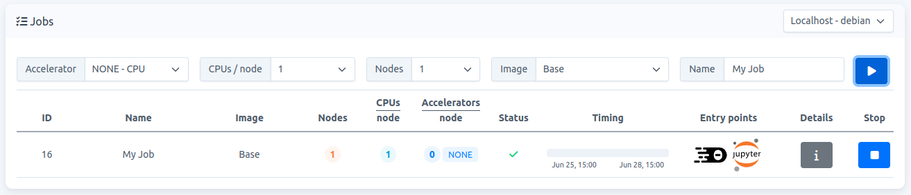

# How to access

The entry points are web-based IDEs that run inside a user-container. They become visible when you start a job in Carme, see red square in Fig. 1.

Fig. 1

As shown, the available entry points are `Code-Server` (left icon) and `JupyterLab` (right icon). Click on the `JupyterLab` icon to access.

