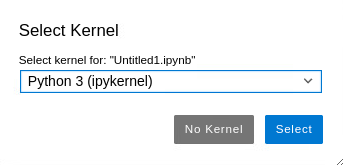
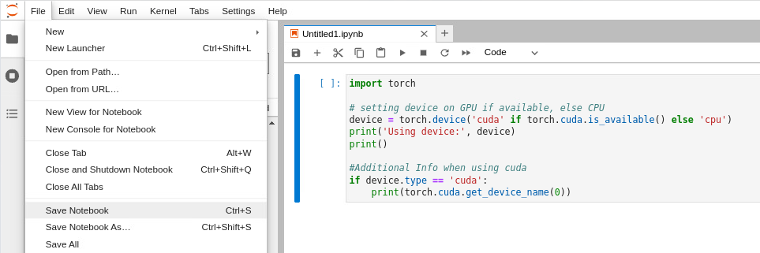

# How to create a file

Here, we create a Jupyter notebook file. 

**Note:** You cannot create files in the parent `home` directory.

## Using the terminal
1. [Open the terminal](../jupyterlab-terminal/jupyterlab-terminal.md) and type: 
  ```
  cd /home/<username>
  ```

2. Create the file. 
  ```
  touch filename.ipynb
  ```

## Using the UI

1. Go to your `/home/<username>` directory. Refer to: [How to navigate to a different directory](../jupyterlab-directory/jupyterlab-directory.md).

   **Note:** You must be in the `/home/<username>` directory to create a file.

2. As shown in Fig. 1 in red, there are two possible ways to create a file: 
    - METHOD 1: Click on the Python icon in the Launcher. If you don't have a kernel, choose the icon with the default kernel, e.g., `Python 3 (ipykernel)`. Otherwise, [Install a Jupyter kernel](../jupyterlab-kernel/jupyterlab-kernel.md).
    - METHOD 2: Go to `File` -> `New` -> `Notebook`. 


   

   Fig. 1.
  
2. If you consider METHOD 2, a box opens for you to choose a kernel. If you don't have one, choose the default kernel `Python 3 (ipykernel)` and click on `Select`. Refer to Fig. 2. 
  
    

    Fig. 2.

3. The file `Untitled1.ipynb` is created. Now you can write your code. Refer to Fig. 3.

    

    Fig. 3.

4. To save the file, go to `File` -> `Save Notebook`. Refer to Fig. 4.

    
  
    Fig. 4.

5. A box opens for you to rename the file. Choose a name and click on `Rename`. Refer to Fig. 5.

    

    Fig. 5.
