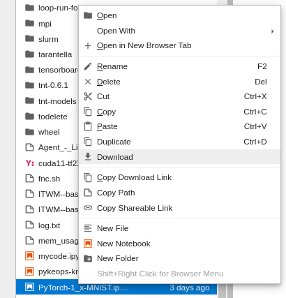

# How to upload and download files

To transfer files, you could consider your github/gitlab repository and employ git commands. If you prefer the IDE instead, then:

### To upload files

1. In the sidebar menu, go to your `/home/<username>` directory.
2. Click on the `upload icon` and choose your file. Refer to Fig. 1, red square.

    

### To download files

1. In the sidebar menu, right-click on the file that you want to download, then click on `Download`. Refer to Fig. 2.

    