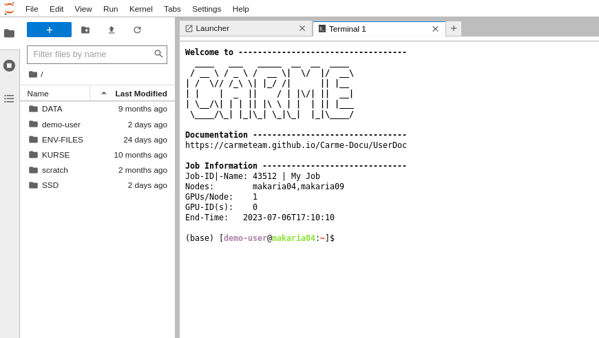
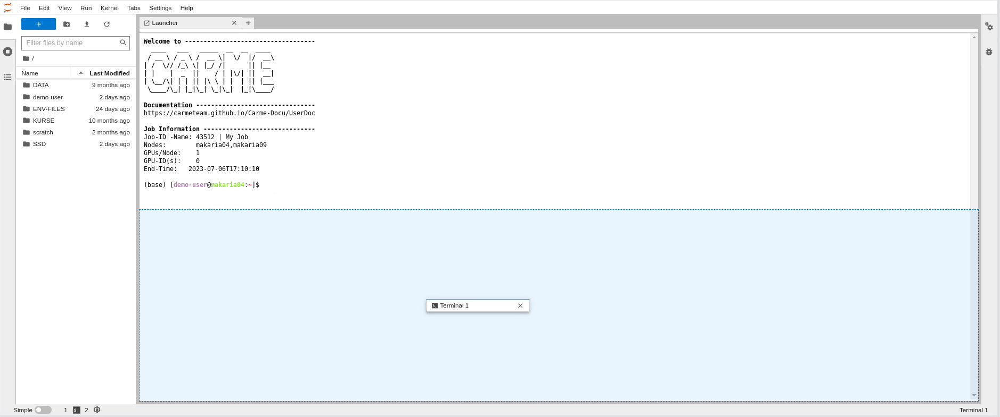
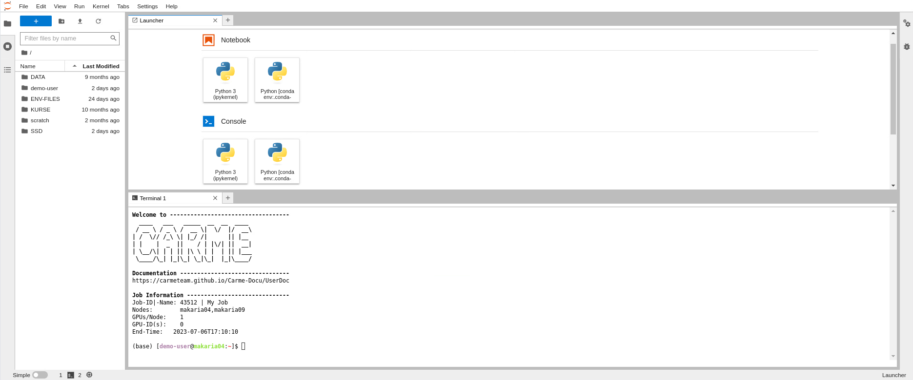
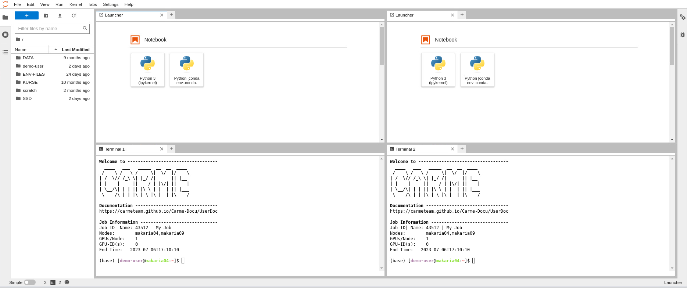

# How to split the screen

1. Once you [open a terminal](../jupyterlab-terminal/jupyterlab-terminal.md), your screen looks like Fig. 1.

    

    Fig. 1.

2. To split the screen in two parts, drag the terminal tab to the bottom. See Fig. 2.

    

    Fig. 2.

3. Your screen is splitted in two parts. The top panel showing the Launcher, and the bottom panel showing the terminal.

    

    Fig. 3.

4. To further split the panels, add new tabs by repeating the steps given in: [How to open a terminal](../jupyterlab-terminal/jupyterlab-terminal.md). Then drag the tabs accordingly. Your screen should look like Fig. 4.  

    
    
    Fig. 4.

