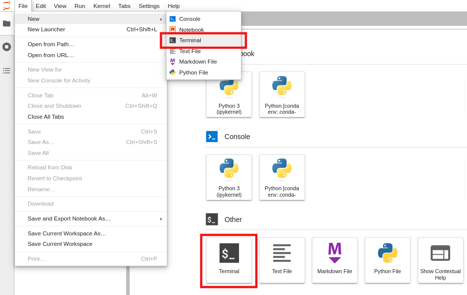

# How to open a terminal
  
1.  To open a terminal, go to `File` -> `New` -> `Terminal`, or click on the `Terminal icon` on the main screen (Launcher). Refer to Fig. 1, red squares.
  
    
   
    Fig. 1.
   
2. Your screen looks like Fig. 2. (Note that the Launcher tab is not present if you opened the terminal via the Launcher screen). 

    

    Fig. 2.

3. To reopen the Launcher, click on the `plus icon` (top-left in Fig. 2) or go to `File` -> `New Launcher`.

