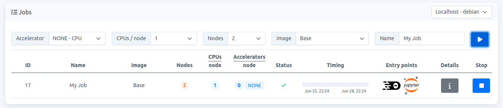

# How to run a python code with mpirun

To test this example start a job with 2 nodes, see Fig. 1

   
    
  Fig. 1.

**Note:** Carme uses `carme_mpirun` instead of `mpirun`. The former adds additional flags to the mpirun command.


1. Open a terminal and install `mpi4py`.

    ```
    python -m pip install mpi4py
    ```

2. As an example, create a python file:

   ```
   cd /home/<username> && touch hello_world.py
   ```
3. Copy the following code to the file:

   ```
   #!/usr/bin/env python
   """
   Parallel Hello World
   """

   from mpi4py import MPI
   import sys

   size = MPI.COMM_WORLD.Get_size()
   rank = MPI.COMM_WORLD.Get_rank()
   name = MPI.Get_processor_name()

   sys.stdout.write(
      "Hello, World! I am process %d of %d on %s.\n"
      % (rank, size, name))
   ```
3. Run the file

    ```
    carme_mpirun -np 2 python hello_world.py
    ```

4. The output shows your two nodes:

   ```
   Hello, World! I am process 1 of 2 on fhgc2.
   Hello, World! I am process 0 of 2 on fhgc1.
   ```
