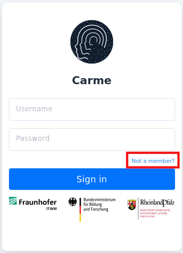
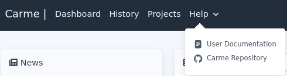

# How to access the local user documentation

**Note:** Your local user documentation is specific to your cluster; therefore, it may differ from this documentation.

## Method 1: Not a member

1. Access Carme URL, e.g., https://cluster.institution.com
2. On the login page, click on `Not a member`, see Fig. 1

   <figure>
   
   <figcaption>Fig. 1.</figcaption>
   </figure>
   

3. You are redirected to your local user documentation

## Method 2: On the Dashboard page

1. Access Carme URL, e.g., https://cluster.institution.com
2. Log in to Carme. Then, on the navigation bar, click on `Help -> User Documentation`, see Fig. 2

   <figure>
   
   <figcaption>Fig. 2.</figcaption>
   </figure>

3. You are redirected to your local user documentation