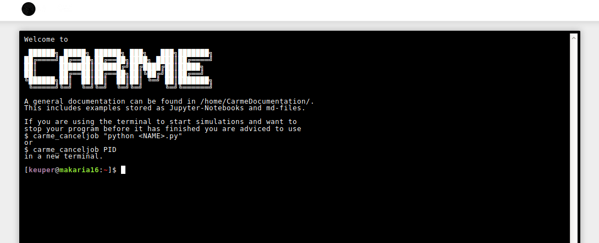

# *Carme* Entry Points
In *Carme*, so called *Entry Points* define web-services which are running inside a user container. 
By design, an *Entry Point* could be any service that communicates via ``https`` to the outside. 
* Advanced users and administrators can add new services inside containers and register them within *Carme*
* Hence, different images might provide different Entry Points

## Default Entry Points
By default, the *Carme* base-image provides the following *Entry Points*

* [Shell](#shell)
* [Jupyter Lab](#jupyter-lab) 
* [TensorBoard](#tensor-board)
* [Theia IDE](#theia)
* [DASK Monitor](#dask) (multi-node jobs only)

## Shell

The *Carme* web-shell allows console access to the master node of a running job.
* look and feel of a direct ssh connection into the job container
* also see the [Howto on working with the terminal](HowTo_Terminal.md)

## Jupyter Lab

[Jupyter Lab](https://jupyterlab.readthedocs.io/en/stable/) is a fully featured web-IDE with support for:
* interactive *Jupyter Notebboks*
* a web-terminal
* editor
* data browser
* data visualization

## Tensor Board
* TODO

## Theia

[Theia](https://www.theia-ide.org/) is an emerging web-IDE with many great development features, including GIT support.

## DASK
* comming soon
