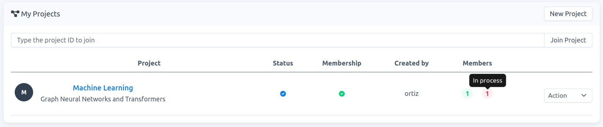

# How to accept a request to join a project

**Note**: When a user submits a request to join a project, you, as `project-admin`, can either `accept` or `reject` this request. Accepting the request does not mean that the user becomes an `active member` of the project. To become an `active member` and have access to the resources of the project template, the membership has to be approved by the carme-administrator.

1.  Go to `Projects`, then click on the project name of interest to access its project detail page, e.g., `Machine Learning` in Fig. 1.
    
    
    
    Fig. 1.
    
2.  On this new page, the user will be listed on `Membership` -\> `In process`. To accept his/her request, click on `Action` -\> `Accept`. In this example `project-owner` `ortiz` accepts the request of user `keuper`, see Fig. 2.
    
    
    
    Fig. 2.
    
3.  Once accepted, The status of the user changes to `Waiting for approval`, see Fig. 3. To become an `active member` of the project, the carme-administrator has to approve the membership.
    

    

    Fig. 3.

6.  Once the carme-administrator approves the membership, the user becomes an `active member` of the project, then he/she can create jobs using the resources allocated to the project template. You, as `project-admin`, **will be informed of this by email**. In the project-detail page the user appears now in the `Members` list, see Fig. 4.

    

    Fig. 4.
