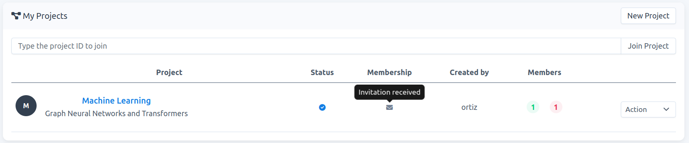
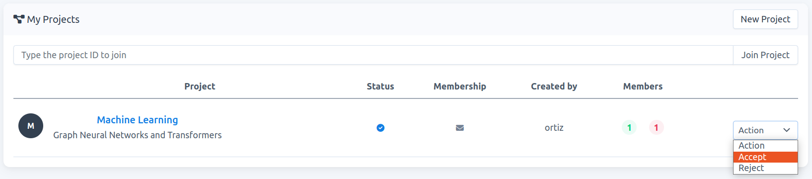
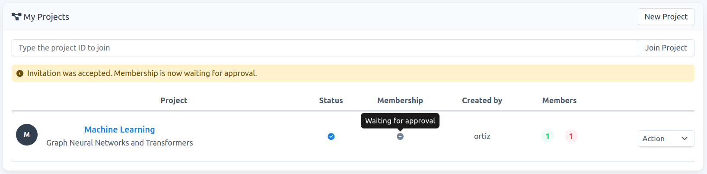
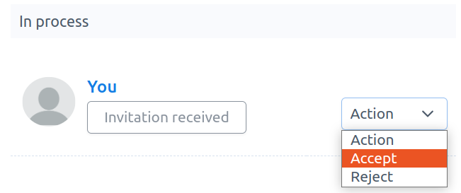
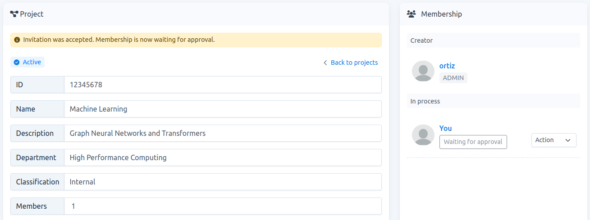
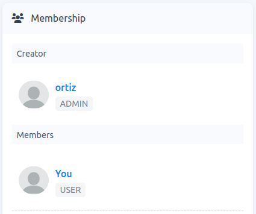

# How to accept an invitation to join a project

**Note**: When you receive an invitation to join a project, you can `accept` or `reject` this invitation. Accepting the invitation does not mean that you become an `active member` of the project. To become an `active member` and have access to the resources of the project template, the membership has to be approved by the `carme-admin`.

1. You can accept the invitation either in your project-list or in the project-detail page.

    ### project-list

    -  Go to `Projects`. If you have received an invitation, the project would be visible in your project-list (if it is not there, **refresh your page**). In Fig. 1 we show the project-list of user `keuper`. In this example `project-owner` `ortiz` has sent an invitation to `keuper`. As you can see, the tooltip in the `Membership` column shows `Invitation received`.
    
    
    
    Fig. 1.
    
    -  To accept the invitation click on `Action` -\> `Accept`, see Fig. 2.
    
    
    
    Fig. 2.
    
    -  Once accepted, your status changes to `Waiting for approval`, see Fig. 3. To become an `active member` of the project, you also need the `carme-admin` approval.
    
    
    
    Fig. 3.
    
    -  Once the `carme-admin` approves your membership,  you receive an email confirming this. You become an `active member` and therefore you can create jobs using the resources allocated to the project template. If this is the case, the tooltip in your `Membership` column would show: `Active member`, see Fig. 4.
    
    
    
    Fig. 4.
    
    ### project-detail

    - Go to `Projects`, then to access the project-detail page, click on the project name of interest, e.g., `Machine Learning` in Fig. 1. On this new page, you will be listed on  `Membership` -> `In process`. You can accept the invitation by clicking on `Action` -\> `Accept`, see Fig. 5.

    
    
    
    Fig. 5.
    
6.  Once accepted, your status changes to `Waiting for approval` see Fig. 6.  To become an `active member`, you also need the `carme-admin` approval.
    
    
    
    Fig. 6.
    
3.  Once the `carme-admin` approves your membership, you receive an email confirming this. Then you become an `active member` and therefore you can create jobs using the resources allocated to the project template. In the project-detail page, you appear now in the `Members` list, see Fig. 7.
    
    
    
    Fig. 7.
    

