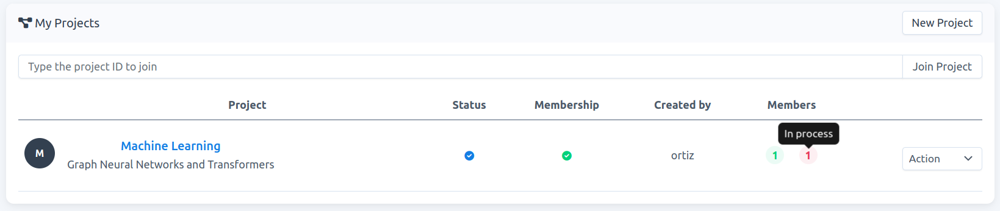
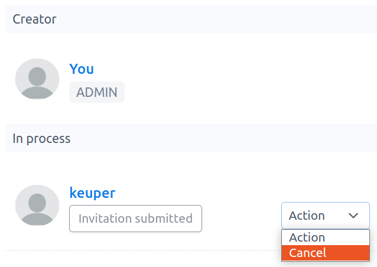

# How to cancel an invitation or request to join a project

**Note**:  When you cancel an invitation or request, the project is removed from the user's project-list.

Two possible scenarios for the `project-admin`:

- When you receive a request to join your project and the user status becomes `Waiting for approval`, then you can cancel this request.

- When you [invite a user](./../project-invite/project-invite.md) to join a project. In the project-detail page, the status of this user becomes `Invitation submitted`. If the user accepts the invitation, the status changes to `Waiting for approval`. In both cases you can cancel the invitation at anytime.

1. Go to Projects, then to acces the project-detail page, click on the project name of interest, e.g., Machine Learning in Fig. 1.

    

    Fig. 1.
    
2. On this new page, the user will be listed on `Membership` -> `In process`. Click on `Action` -> `Cancel`, see Fig. 2. 
    
    
    
    Fig. 2.
    
2.  Once cancelled, a modal form appears. You must confirm that you want to cancel the invitation. Check `Yes, I'm sure` and click on `Confirm`, see Fig. 3. Then, the project is automatically removed from the user's project-list.
    
    
    
    Fig. 3.
   
