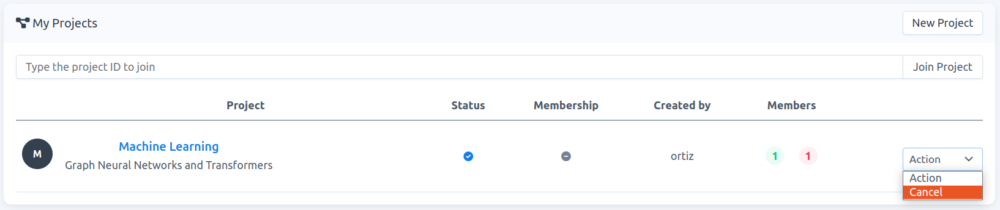
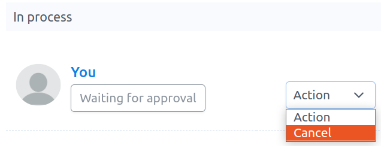
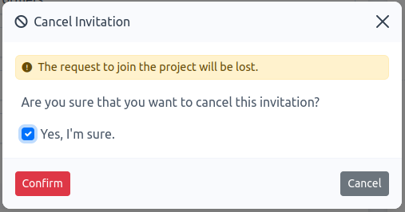

# How to cancel an invitation or request to join a project

**Note**:  When you cancel an invitation or request, the project is removed from your project-list.

Two possible scenarios:

- When you submit a request to join a project and your status is `Invitation requested` or `Waiting for approval`, then you can cancel your request. 

- When you receive an invitation to join a project and  your status becomes `Waiting for approval`, then you can cancel the invitation.

1. You can cancel the invitation or request either in your project-list or in the project-detail page.

    ### project-list

    - Go to `Projects` and click on `Action` -\> `Cancel`.
    
      
    
      Fig. 1.

    ### project-detail

    - Go to `Projects`, then to acces the project-detail page, click on the project name of interest, e.g., `Machine Learning` in Fig. 1. On this new page, you are listed on  `Membership` -> `In process`. Click on `Action` -\> `Cancel`, see Fig. 2.
    
      
    
      Fig. 2.
    
2.  Once cancelled, a modal form appears. You must confirm that you want to cancel the invitation or request. 

    - Check `Yes, I'm sure` and click on `Confirm`, see Fig. 3. Then, the project is automatically removed from your project-list.
    
      
    
      Fig. 3.
   
