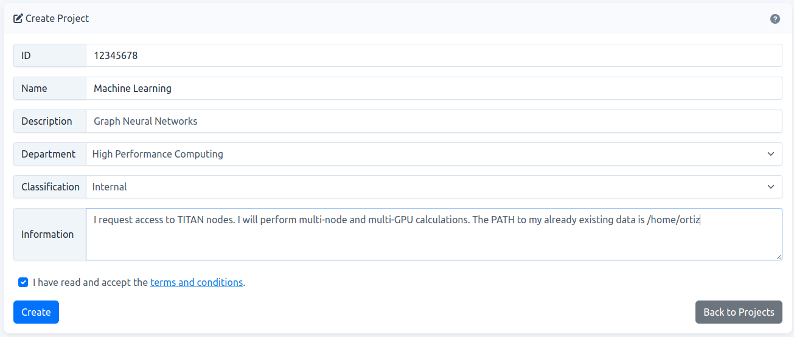
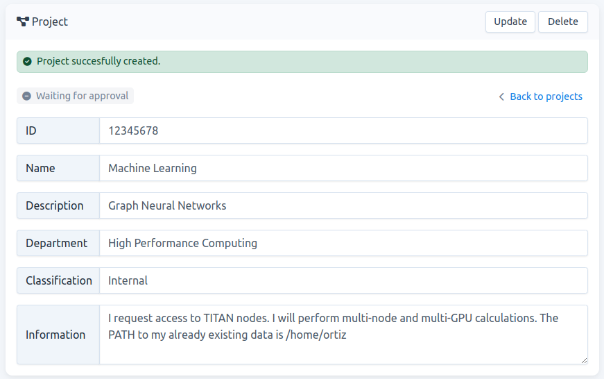
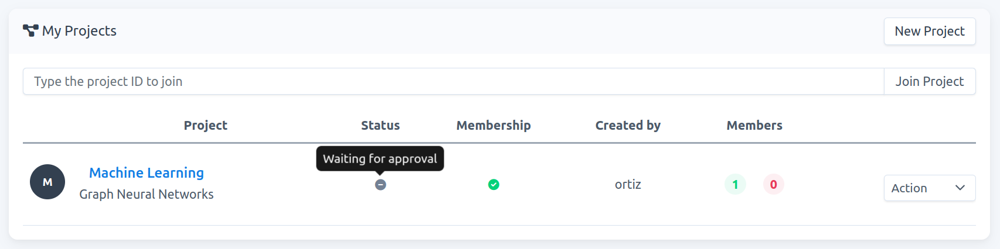
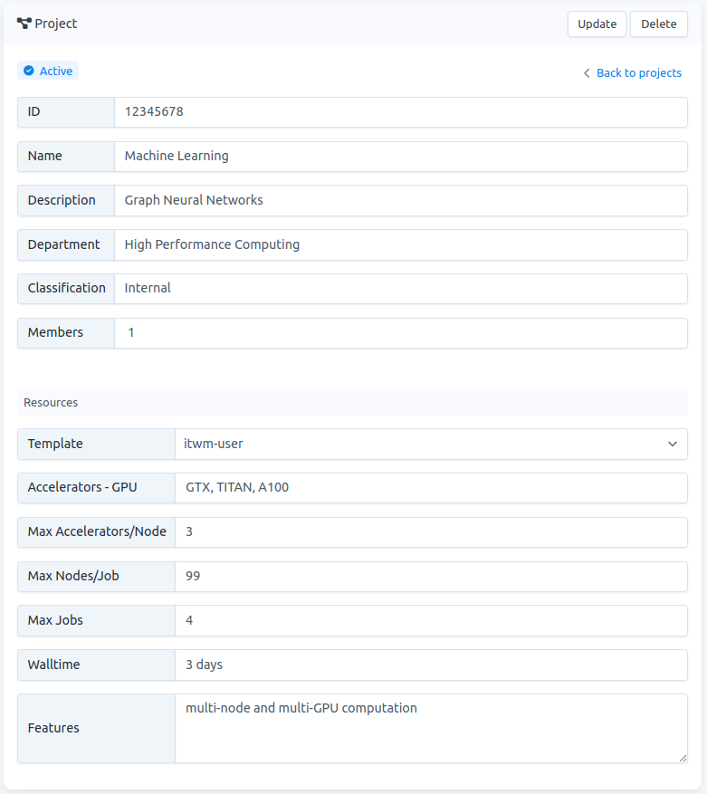

# Create a New Project

## Requirements
* You have to be a full ITWM employee
    * PhD Students, interns, Hiwis have to ask their ITWM supervisors to create a project for them!
    * External users have to ask their ITWM contact to create a project for them

* Your project must have a **project ID**. If you don't have one, refer to [How to get a project ID](./../project-id/project-id.md).

## Create a project on STYX
**NOTE:** When you create a project you become the `project-owner`. It gives you full right over the project (you are also a `project-admin`).

1.  Go to  `Projects` and click on `Ńew Project`.
    
    
    
    Fig. 1.
    
2.  Fill the form and accept the [terms and conditions](https://gitlab.itwm.fraunhofer.de/styx/user-documentation/-/blob/main/user-agreement.md). Then click on `Create`. An example is given in Fig. 2.
    
    

Fig. 2.

### How to fill the form?

- **ID**: It is your `project ID`. Refer to [How to get a project ID](./Projects/project-id/project-id.md). In this example it is ITWM #`12345678`. 
- **Name**: Choose a name that suits your project.
    max-length: 50 characters.
- **Description**: Describe your project.
    max-length: 70 characters.
- **Department**: ITWM departments are listed. In Fig. 1, e.g., the High Performance Computing department is chosen. Choose the one that corresponds to you.
- **Classification**: Fraunhofer has three active classes for classification:
    - **Public**: Intended for publication. No harm in the case of accidental loss, misuse, or unauthorized handling.
    - **Internal** (default): Restricted group of people. Limited damage in the event of loss, misuse, or unauthorized handling.
    - **Confidential**: Narrowly limited group of people. Potentially significant damage effect in the event of loss, misuse, or unauthorized handling.

Choose the one that suits your project. For more information refer to [Informationsklassifizierung](https://support.itwm.fraunhofer.de/Main/OA%20Informationsklassifizierung).

- **Information**: Add the resources that you need to run your project, e.g., GPU type, multi-node and/or multi GPU computation, special requirements in your image, and so on. If not specified, default values will be considered.

    **NOTE:** If you already have data stored in Styx and want to transfer this information to your new project partition, specify the PATH in the information field, refer to Fig. 2.

3.  If your project is successfully created, your page should be similar to Fig. 3. As you can see, your project status is `Waiting for approval`.
    
    
    
    Fig. 3.
    

4.  In your project-list page (click on `Back to projects` in Fig. 3), the tooltip in your status column also shows `Waiting for approval`, see Fig. 4.
    
    
    
    Fig. 4.
    
5.  Resource allocation is handled in the backend. Once this is set you will receive an email informing you that your project is `active`. Therefore, the next time that you check your project it will look like Fig. 5.
    

    

Fig. 5.

### How to read the resource template?

- `Template` : The name of the template allocated to you. Your project may have multiple templates depending on your need. Most users will have one template for each project. In this example the name is `itwm-user`.
- `Accelerators - NAME` : In this case you have been assigned 3 GPUS: GTX, TITAN, and A100.
- `Max Accelerators/Node`: In this case, for each job, you can run a max of 3 GPUs per compute node.
- `Max Nodes/Job`: You have access to a max of 99 nodes per job. 
- `Max Jobs` : You can have a maximum of 4 jobs running simultaneously.
- `Walltime` : Your running job expires after 3 days. You can request an extension if needed. For that, contact the `carme-admin` via [Mattermost](https://chat.cc-hpc-cloud.de/itwm-hpc/messages/@ortiz) or by [Email](mailto:styx-support@itwm.fraunhofer.de).
- `Features` :  Additional information.

6. Now you are ready to:
    - [Update your project](../project-update/project-update.md).
    - [Delete your project](../project-delete/project-delete.md).
