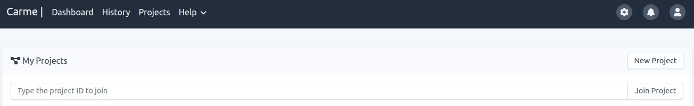

# How to create a project

**Note:** If projects are disabled in your Carme-cluster, you can skip this information.

**Remarks:**
- When you create a project you become the `project-owner`. It gives you full right over the project.  
- Resource allocation is very limited in `My project` (default project). Consequently, each user is encouraged to either create or join a project.
- If your Carme-cluster does not allow all users to create projects, then you can join an existing one. Refer to [How to join a project](../project-request/project-request.md).

1.  In your navigation bar, go to  `Projects`. Then, click on `Ńew Project`, see Fig. 1.
    
    
    
    Fig. 1.
    
2.  Fill the form and accept the terms and conditions. Then click on `Create`. An example is given in Fig. 2.
    
    

    Fig. 2.

## How to fill the form?

- **ID**: It is your `project ID`. Refer to [How to get a project ID](./Projects/project-id/project-id.md). 
- **Name**: Choose a name that suits your project.
    max-length: 50 characters.
- **Description**: Describe your project.
    max-length: 70 characters.
- **Department**: Your institution departments are listed here. In Fig. 2, e.g., the High Performance Computing department is chosen. Choose the one that corresponds to you.
- **Classification**: By default we have 3 types:
    - **Public**: Intended for publication. No harm in the case of accidental loss, misuse, or unauthorized handling. 
      
      - Users have access to a scratch folder that is accessible by all users in the system
      - Users have access to a project folder that is accessible only by members of the project
      - User have access to `/home/username`. It is accessible only by the user
    - **Internal** (default): Restricted group of people. Limited damage in the event of loss, misuse, or unauthorized handling 
      - Users don't have access to a scratch folder 
      - Users have access to a project folder that is accessible only by members of the project
      - User have access to `/home/username`. It is accessible only by the user
      - Reading or writing permissions can be requested in the Information field
    - **Confidential**: Narrowly limited group of people. Potentially significant damage effect in the event of loss, misuse, or unauthorized handling. 
      - Users don't have access to a scratch folder
      - Users have access to a project folder that is accessible only by members of the project
      - Users don't have access to `/home/username`
      - Reading or writing permissions can be requested in the Information field

- **Information**: Specify all what you need (if not specified, default values are considered):
   - The resources that you need, e.g., GPU type, multi-node and/or multi GPU computation, special requirements in your image, and so on 
   - The permissions that you need. You can request writing permissions in all files of the project folder (e.g., user A is able to modify the file created by user B) or just request reading permissions (e.g., user A can only make a copy of the file created by user B) 

3.  If your project is successfully created, your page should be similar to Fig. 3. As you can see, your project status is `Waiting for approval`.
    
    
    
    Fig. 3.

4.  Similarly, in your project-list page, the tooltip in your status column also shows `Waiting for approval`, see Fig. 4.
    
    
    
    Fig. 4.
    
5.  Resource allocation is handled in the backend. The user does not need to worry about this. Once this is set you will receive an email informing you that your project is `active`. Therefore, the next time that you check your project it will look like Fig. 5.
    

    

Fig. 5.

### How to read the resource template?

- `Template` : The name of the template allocated to you. Your project may have multiple templates depending on your needs. Most users will only have one template for each project. In this example the template name is `itwm-user`.
- `Accelerators` : In this case you have been assigned 3 GPUS: GTX, TITAN, and A100.
- `Max Accelerators/Node`: In this case, for each job, you can run a max of 3 accelerators per compute node.
- `Max Nodes/Job`: You have access to a max of 99 nodes per job. 
- `Max Jobs` : You can have a maximum of 4 jobs running simultaneously.
- `Walltime` : Your running job expires after 3 days. You can request an extension if needed. For that, contact the carme-administrator
- `Features` :  Additional information.

6. Now you are ready to [start a job](../../Basic/job-start/job-start.md) using the resources of the project. If this is your first time, please follow the steps given in **Usage: First Time**.
