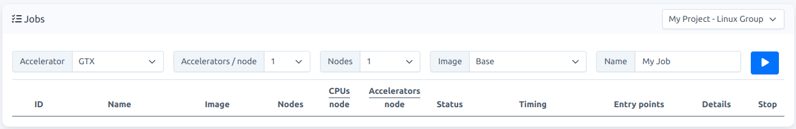
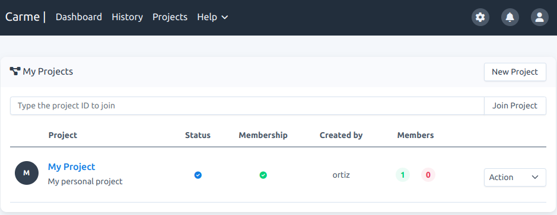

# What is a project

A project is a frontend application that organize the users in groups. Each group share the same compute resources and have access to common files and folders. This feature can be disabled by the carme-administrator. 

By default, all users have one project called `My Project`. A Project on its own has no meaning unless a template is assigned to it. The template assigned to `My Project` has the same name as the Linux user group. Resources assigned to this template are set by the carme-administrator. 

- In your `Jobs card`, the project and template names appear on the header, see Fig. 1.

  

  Fig. 1

- In your `Projects`, the default project is listed, see Fig. 2.

  

  Fig. 2

Users can create projects and request specific templates (or resources) for their projects. When you set a project, a project folder is assigned to it. Only members of the project can access it.

**Note:** If you don't have projects in your Carme cluster, then it was disabled.

## Characteristics
* Projects should be bound to specific tasks or research groups in your organization. There should not be a generic project for all tasks.
* Projects, in order to be active, have to approved by the carme-administrator
* Projects have an expiration date set by the carme-administrator.
* Projects can have multiple templates
* Projects have fixed compute resources (e.g., max number of jobs, max number of nodes per job, max number of accelerators per node, etc.)
* Projects can have multiple users and a user can be a member of multiple projects.
* Projects have three levels of membership: owner, admins, and users.
    * The owner creates the project and is the only one who can delete it. 
    * The owner must be a full-time
    * The owner can delete a project.
    * The admin can add and remove users.

## Recommendations

* The owner of the project should be the team lead of a specific group in your organization
* Interns and externs should not be admins of a project

