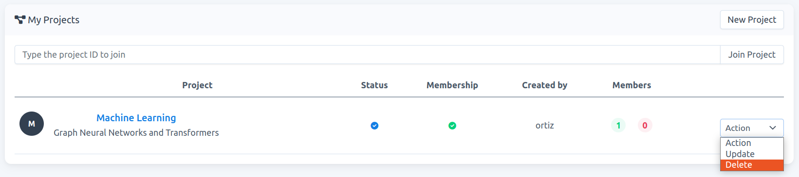
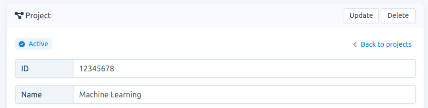
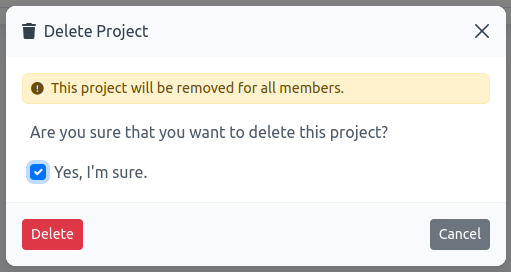

# How to delete a project

**Note:** Only the `project owner` is allowed to delete his/her project. Once the project is deleted, **all members of the project will lose access to it**.

1. You can delete a project either in your project-list or in the project-detail page.
    
    ### project-list

    - Go to `Projects`, then click on `Action` -\> `Delete`, see Fig. 1.
    
      
    
      Fig. 1.
    
    ### project-detail

    - Go to `Projects`. then to acces the project-detail page, click on the project name of interest, e.g., `Machine Learning` in Fig. 1. On this new page, on the header click on `Delete`, see Fig. 2.

    
      
    
      Fig. 2.
    
2.  Once you click on `Delete`, a modal form appears. You must confirm that your want to delete the project.

    - Check `Yes, I'm sure` and click on `Delete`, see Fig. 3. The project is automatically removed from your project list.
    
      
	
	  Fig. 3.
	
